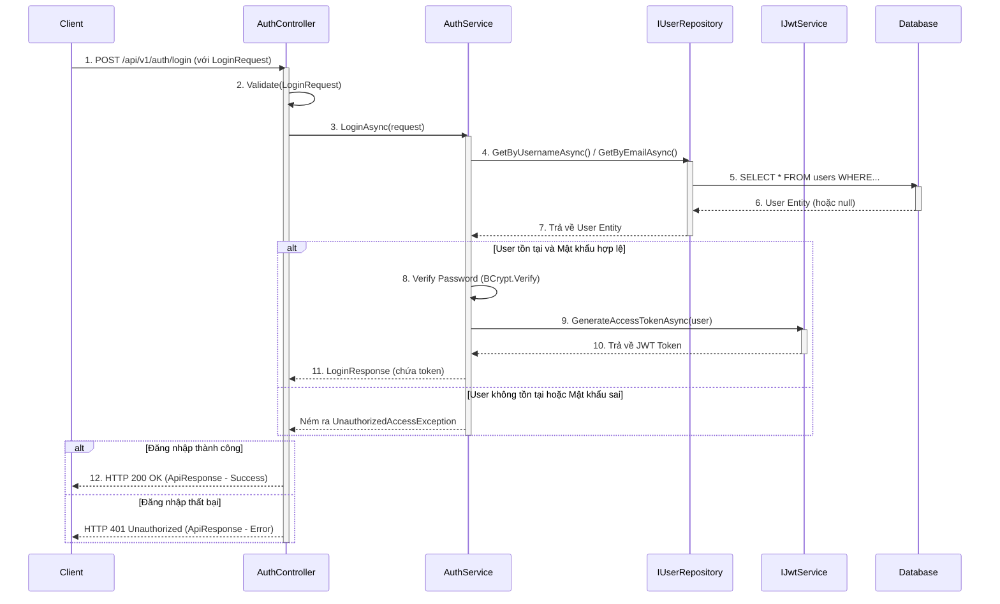
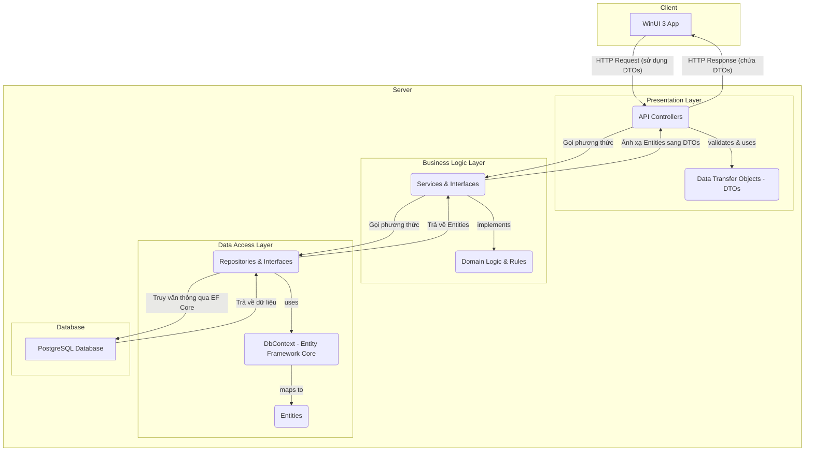
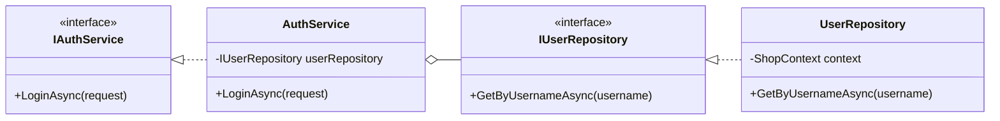

# BÁO CÁO DỰ ÁN MYSHOP2025

---

## 0. THÔNG TIN CÁC THÀNH VIÊN

**[PHÂN CÔNG: LEADER]**

| STT | Họ và Tên           | MSSV     | Vai trò                    | Email                         | Github                                                                              |
| --- | ------------------- | -------- | -------------------------- | ----------------------------- | ----------------------------------------------------------------------------------- |
| 1   | Nguyễn Hưng Thịnh   | 23120200 | Backend Developer          | nguyenhungthinha1@gmail.com   | [oppaii230205](https://github.com/oppaii230205)                                     |
| 2   | Lê Thành Công       | 23120222 | Leader / Backend Developer | ltchcmus@gmail.com            | [ltchcmus](https://github.com/ltchcmus) / [05-victor](https://github.com/05-victor) |
| 3   | Lê Tấn Hiệp         | 23120255 | Frontend Developer         | tanhiep24135@gmail.com        | [ThachHaoo](https://github.com/ThachHaoo)                                                                            |
| 4   | Tống Dương Thái Hòa | 23120262 | Frontend Developer         | tdthoa.hry@gmai.com           | [henry-banana](https://github.com/henry-banana)                                     |
| 5   | Nguyễn Huy Hoàng    | 23122031 | AI Developer               | 23122031@student.hcmus.edu.vn | [Link](https://github.com/hhlearntocode)                                            |

### Phân chia team:

- **Backend Team:** Lê Thành Công (Leader), Nguyễn Hưng Thịnh
- **Frontend Team:** Lê Tấn Hiệp (Trưởng team), Tống Dương Thái Hòa
- **AI Team:** Nguyễn Huy Hoàng (Leader hỗ trợ khi cần thiết)

### Chi tiết vai trò và trách nhiệm:

#### 1. Lê Thành Công - Leader / Backend Developer

- **Vai trò:** Leader của dự án và Backend Developer chính
- **Trách nhiệm:**
  - Quản lý tổng thể dự án, điều phối công việc giữa các team
  - Phân công nhiệm vụ và thiết lập deadline cho các thành viên
  - Review code và đảm bảo chất lượng sản phẩm
  - Chịu trách nhiệm về Security và Authentication/Authorization
  - Phát triển các service quan trọng:
    - Email API (đã hoàn thành)
    - OAuth2 integration (nếu đủ thời gian)
    - JWT Authentication (Đã hoàn thành)
    - External API integration (Admin code validation)
  - Hỗ trợ tất cả các team khi gặp vấn đề blocking
  - Viết và hoàn thiện tài liệu Proposal

#### 2. Nguyễn Hưng Thịnh - Backend Developer

- **Vai trò:** Backend Developer chính
- **Trách nhiệm:**
  - Nhận yêu cầu trực tiếp từ Leader
  - Triển khai các API endpoints theo specification
  - Phát triển các chức năng:
    - Product management APIs (CRUD, filtering, sorting, rating)
    - Order management APIs (statistics, tracking, revenue)
    - User & Profile management APIs
    - Data export functionality (Excel/Access)
  - Implement business logic và data validation
  - Đảm bảo follow Clean Architecture pattern
  - Testing và debugging APIs

#### 3. Lê Tấn Hiệp - Frontend Team Lead

- **Vai trò:** Trưởng team Frontend
- **Trách nhiệm:**
  - Nhận deadline và yêu cầu từ Leader
  - Phân chia công việc cho team Frontend
  - Điều phối và hỗ trợ Tống Dương Thái Hòa trong quá trình phát triển
  - Đảm bảo team Frontend hoàn thành đúng tiến độ
  - Review code của team Frontend
  - Thiết kế kiến trúc Frontend và MVVM pattern
  - Implement các tính năng phức tạp và critical
  - Tương tác với Backend team để sync API requirements

#### 4. Tống Dương Thái Hòa - Frontend Developer

- **Vai trò:** Frontend Developer
- **Trách nhiệm:**
  - Nhận việc trực tiếp từ Lê Tấn Hiệp (Frontend Team Lead)
  - Triển khai các yêu cầu UI/UX theo phân công
  - Phát triển các components và views:
    - Login/Register interfaces
    - Admin Dashboard components
    - Product management UI
    - Charts và visualizations
  - Implement data binding và MVVM pattern
  - Testing giao diện và đảm bảo UX tốt
  - Báo cáo tiến độ cho Team Lead

#### 5. Nguyễn Huy Hoàng - AI Developer

- **Vai trò:** AI Developer
- **Trách nhiệm:**
  - Nhận yêu cầu trực tiếp từ Leader
  - Thực hiện toàn bộ các tính năng AI/Machine Learning
  - Đánh giá và tối ưu hóa model performance
  - Báo cáo tiến độ hàng tuần cho Leader
  - Yêu cầu hỗ trợ từ Leader khi cần thiết
  - Phối hợp với Backend team để lấy dữ liệu training

### Thông tin liên hệ nhóm:

- **Tên nhóm:** Nhóm 5
- **Lớp:** CQ2023/31
- **Môn học:** Lập Trình Window
- **Giảng viên:** Ths. Trần Duy Quang

---

## 1. CHỨC NĂNG ỨNG DỤNG

**[PHÂN CÔNG: LEADER + AI hỗ trợ]**

### 1.1. Tổng quan dự án

**MyShop2025** là một ứng dụng thương mại điện tử được xây dựng bằng **WinUI 3** và **ASP.NET Core** kèm với một số **Service** đã được thiết kế từ các dự án khác, cung cấp giải pháp quản lý bán hàng toàn diện với hệ thống dashboard đa cấp. Ứng dụng được thiết kế với 3 vai trò người dùng chính, mỗi vai trò có giao diện và chức năng riêng biệt:

- **Admin Dashboard:** Giao diện quản trị toàn diện cho việc quản lý sản phẩm, tài khoản, và phân tích doanh số
- **Sales Agent Dashboard:** Giao diện dành cho đại lý bán hàng với tính năng tiếp thị liên kết (affiliate marketing)
- **Customer Dashboard:** Giao diện mua sắm trực tuyến cho người dùng cuối

Hệ thống sử dụng **AI/Machine Learning** để hỗ trợ dự đoán doanh thu, phân tích xu hướng sản phẩm, và tối ưu hóa chiến lược kinh doanh.

### 1.2. Các chức năng chính

#### 1.2.1. Chức năng cho User (Customer)

- **Xác thực và quản lý tài khoản**

  - Đăng ký tài khoản mới
  - Đăng nhập/Đăng xuất
  - Xác thực email (Email verification)
  - Cập nhật thông tin cá nhân (hồ sơ, địa chỉ, số điện thoại)

- **Quản lý sản phẩm và mua sắm**

  - Xem danh sách sản phẩm với phân trang
  - Tìm kiếm sản phẩm theo tên
  - Lọc sản phẩm theo nhãn hàng (brand)
  - Sắp xếp danh sách sản phẩm (theo giá, tên, độ phổ biến)
  - Xem chi tiết sản phẩm (mô tả, hình ảnh, giá, đánh giá)
  - Thêm sản phẩm vào giỏ hàng
  - Quản lý giỏ hàng (xem, cập nhật số lượng, xóa sản phẩm)
  - Thanh toán và đặt hàng (optional)

- **Quản lý đơn hàng** (Nếu đủ thời gian sẽ làm thêm)
  - Xem lịch sử đơn hàng
  - Theo dõi trạng thái đơn hàng
  - Xem chi tiết đơn hàng

#### 1.2.2. Chức năng cho Sales Agent

- **Tất cả chức năng của User**

  - Sales Agent có thể sử dụng tất cả các chức năng mua sắm như một khách hàng thông thường

- **Dashboard Sales Agent**

  - Xem tổng quan doanh số cá nhân
  - Thống kê hoa hồng đã kiếm được
  - Xem danh sách đơn hàng từ affiliate link

- **Tiếp thị liên kết (Affiliate Marketing)**
  - Tạo link affiliate cho từng sản phẩm
  - Chia sẻ link affiliate với khách hàng
  - Theo dõi số lượt click vào link
  - Theo dõi đơn hàng từ link affiliate
  - Nhận hoa hồng tự động khi khách hàng mua hàng qua link
  - Xem chi tiết tỷ lệ hoa hồng theo sản phẩm
  - Rút tiền hoa hồng

#### 1.2.3. Chức năng cho Admin

- **Dashboard quản trị với AI Analytics**
  - Tổng quan doanh số (tổng doanh thu, số đơn hàng, số khách hàng)
  - Biểu đồ thống kê doanh thu theo thời gian (ngày, tuần, tháng)
  - Biểu đồ phân tích doanh số theo danh mục
  - Hiển thị top 5 sản phẩm đang được ưu chuộng
  - Thống kê hiệu suất Sales Agent (Optional)
- **Quản lý sản phẩm**

  - Thêm sản phẩm mới (tên, mô tả, giá, hình ảnh, danh mục, nhãn hàng)
  - Sửa thông tin sản phẩm
  - Xóa sản phẩm
  - Quản lý tồn kho sản phẩm
  - Quản lý danh mục và nhãn hàng

- **Quản lý tài khoản Sales Agent**

  - Thêm tài khoản Sales Agent mới
  - Xóa tài khoản Sales Agent
  - Xem danh sách tất cả Sales Agent
  - Xem hiệu suất của từng Sales Agent
  - Cấu hình tỷ lệ hoa hồng

- **Quản lý đơn hàng**

  - Xem tất cả đơn hàng
  - Cập nhật các thông tin đơn hàng

- **Xem và quản lý thông tin khách hàng**
  - Xem danh sách khách hàng
  - Xem những khách hàng đang hoạt động tích cực gần đây

#### 1.2.4. Chức năng AI [AI Developer bổ sung]

- Weekly Sales Forecast
- Sales & Promo Demand Forecast

### 1.3. Bao phủ chuẩn đầu ra môn học

Dự án bao phủ đầy đủ các kỹ năng và kiến thức được học trên lớp:

- **WinUI 3 Development:** Xây dựng giao diện desktop hiện đại với WinUI 3
- **XAML và Data Binding:** Sử dụng XAML để thiết kế UI, áp dụng data binding two-way
- **MVVM Pattern:** Áp dụng mô hình MVVM với CommunityToolkit.Mvvm
- **Navigation:** Triển khai navigation giữa các page/view khác nhau
- **API Integration:** Kết nối với backend API (ASP.NET Core) để lấy và cập nhật dữ liệu
- **Authentication & Authorization:** Xác thực người dùng và phân quyền theo role
- **State Management:** Quản lý trạng thái ứng dụng
- **Local Storage:** Lưu trữ dữ liệu local (settings, cache)
- **Async Programming:** Xử lý bất đồng bộ với async/await
- **Error Handling:** Xử lý lỗi và hiển thị thông báo cho người dùng
- **Charts & Visualization:** Hiển thị biểu đồ thống kê (sử dụng thư viện bên thứ 3)
- **Responsive Design:** Giao diện responsive phù hợp với nhiều kích thước màn hình
- **AI Integration:** Sử dụng python code service AI và tích hợp vào ứng dụng
- **Microservice:** Sử dụng nhiều service khác nhau hỗ trợ nhiều nghiệp vụ khác nhau như: AI service, Mail Service, Identity Service...
- **Web Application Programing:** Có sử dụng các công nghệ cao như (React/nextjs, tailwind, ...) để thiết kế web mua code để kích hoạt ứng dụng

---

## 2. GIAO DIỆN - PROTOTYPE FIGMA

**[PHÂN CÔNG: FRONTEND DEVELOPER]**

### 2.1. Luồng chức năng chính

**Công cụ sử dụng:** Figma + Figma Auto Layout + Responsive Frame

Ứng dụng được thiết kế theo mô hình **đa vai trò người dùng**, mỗi vai trò có trải nghiệm và luồng thao tác riêng.

Luồng được xây dựng trực quan trong **Figma Prototype**, hỗ trợ click navigation giữa các frame để mô phỏng hành vi thật.

#### Tổng quan luồng:

```
Login → Detect Role
├── Admin → Dashboard / Products / Orders / Reports / Users / Settings
├── SalesAgent → Dashboard / Products / Orders / Reports (read-only) / Profile
└── Customer → Home / Products / My Orders / Profile
```

### 2.2. Các màn hình chính

#### 2.2.1. Customer Flow

**Màn hình đăng nhập/đăng ký**

- Hai layout song song (Login – Register), sử dụng gradient nền WinUI 3:
  - Login: xanh navy `#1A4D8F → #2563EB`
  - Register: xanh ngọc `#10B981 → #00AEEF`
- Giao diện card bo tròn, bóng đổ mềm, sử dụng Inter/Roboto.
- Login gồm: Username/Email, Password, Remember me, nút “Sign In” và “Sign in with Google”.
- Register gồm: Username, Email, Phone, Password, Confirm Password, Role (Customer/SalesAgent).
- Có liên kết cấu hình server “⚙ Configure Server” ở góc dưới trái.

**Màn hình trang chủ**

- Thanh điều hướng ngang (sau này được thống nhất chuyển thành sidebar).
- Hero banner hiển thị lời chào và sản phẩm nổi bật.
- Grid sản phẩm (3–4 cột) hiển thị ảnh, tên, giá, đánh giá.
- Có các filter cơ bản: Tên, Loại, Khoảng giá, Sort theo Giá / Rating.
- Nút “Add to Cart” với hover animation.

**Màn hình sản phẩm**

- Lưới sản phẩm đầy đủ thông tin: hình, tên, giá, rating, trạng thái tồn kho.
- Bộ lọc đầu trang: Tìm kiếm, Loại hàng, Khoảng giá, Sắp xếp.
- Có nút “View Details” mở modal chi tiết sản phẩm.

**Màn hình giỏ hàng**

- Bảng hiển thị danh sách sản phẩm trong giỏ:
  | Hình | Tên sản phẩm | Số lượng | Đơn giá | Thành tiền | Xóa |
- Tổng giá trị, thuế, phí vận chuyển, và tổng đơn hàng.
- Nút **Proceed to Checkout** → hiển thị modal xác nhận.

#### 2.2.2. Admin Dashboard Flow (Focus chính)

- **Dashboard Overview**
  - [Mô tả chi tiết dashboard admin]
  - [Các widget thống kê]
  - [Biểu đồ và báo cáo]
- **Quản lý sản phẩm**
  - [Giao diện CRUD sản phẩm]
- **Quản lý đơn hàng**
  - [Giao diện quản lý đơn hàng]
    ...

#### 2.2.3. Salasagent Dasboard Flow

- **Dashboard Overview**
- Mô tả
  ...

### 2.3. User Experience (UX)

- [Mô tả về trải nghiệm người dùng]
- [Nguyên tắc thiết kế đã áp dụng]

---

## 3. LÀM VIỆC NHÓM

**[PHÂN CÔNG: LEADER]**

### 3.1. Phân công công việc

Dự án được chia thành các giai đoạn (Sprint) với phân công cụ thể cho từng thành viên:

#### Sprint 1: Foundation Setup (13/10 - 18/10/2025)

| Thành viên                                  | Vai trò      | Nhiệm vụ chính                                                                                                                                                                                                                                                                                                                                | Deadline        | Trạng thái     |
| ------------------------------------------- | ------------ | --------------------------------------------------------------------------------------------------------------------------------------------------------------------------------------------------------------------------------------------------------------------------------------------------------------------------------------------- | --------------- | -------------- |
| **Frontend Team**<br>(Hiệp, Hòa)            | Frontend Dev | **1.** Thiết kế và hoàn thiện giao diện Login/Register (đẹp, UX tốt)<br>**2.** Tích hợp nút Login với Google<br>**3.** Tạo folder ApiServer, sử dụng Refit để gọi API<br>**4.** Tìm hiểu Dependency Injection và register services<br>**5.** Implement chức năng Register/Login với backend<br>**6.** Lưu JWT token bằng PasswordVault        | 17-18/10        | ✅ Completed   |
| **Backend Team**<br>(Công, Thịnh)           | Backend Dev  | **1.** Xây dựng bảng Profile (userId, avatar, fullName, sdt, email, address, jobTitle)<br>**2.** API: profiles/get, profiles/create, profiles/update<br>**3.** API: users/activate-trial, users/verify-email, users/change-password<br>**4.** Tạo Email Service và API send-mail-verify với template HTML<br>**5.** Follow clean architecture | 16-17/10        | ✅ Completed   |
| **Leader**<br>(Công)                        | Leader/Docs  | **1.** Tổng hợp tài liệu dự án<br>**2.** Viết proposal section 1 (Chức năng ứng dụng)<br>**3.** Review và hỗ trợ Backend team<br>**4.** Quản lý tiến độ và điều phối công việc                                                                                                                                                                | Ongoing         | ✅ Completed   |
| **AI Team**<br>(Huy Hoàng + Leader support) | AI Dev       | **1.** Nghiên cứu feature AI cho admin<br>**2.** Khảo sát dữ liệu cần thiết từ backend<br>**3.** Lên kế hoạch triển khai AI features                                                                                                                                                                                                          | 15/10 (Bắt đầu) | 🔄 In Progress |

#### Sprint 2: Core Features - Phase 2 (24/10 - 06/11/2025) _[Gia hạn +5 ngày]_

| Thành viên                                  | Vai trò      | Nhiệm vụ chính                                                                                                                                                                                                                                                                                                                                                                                                                                                                                                                                                                                                                                                                                                                                                                                                                         | Deadline                                | Trạng thái     |
| ------------------------------------------- | ------------ | -------------------------------------------------------------------------------------------------------------------------------------------------------------------------------------------------------------------------------------------------------------------------------------------------------------------------------------------------------------------------------------------------------------------------------------------------------------------------------------------------------------------------------------------------------------------------------------------------------------------------------------------------------------------------------------------------------------------------------------------------------------------------------------------------------------------------------------- | --------------------------------------- | -------------- |
| **Frontend Team**<br>(Hiệp, Hòa)            | Frontend Dev | **Dashboard Admin:**<br>• Hiển thị đầy đủ products với phân trang<br>• Hiển thị số đơn hàng trong ngày<br>• Hiển thị doanh thu trong ngày<br>• Page: Sản phẩm có số lượng < 10<br>• Biểu đồ thống kê (yêu cầu API từ backend)<br>• Top sản phẩm ưu chuộng (sắp xếp theo sao)<br>**Product Management:**<br>• Lọc sản phẩm (tên, thiết bị, khoảng giá [min,max])<br>• Sắp xếp (số sao, giá tăng/giảm)<br>• Dialog thêm/sửa/xóa sản phẩm<br>• Nút xuất sản phẩm<br>**Order Management:**<br>• Hiển thị sản phẩm đã đặt<br>• Hover hiển thị doanh thu sản phẩm<br>• Top sản phẩm doanh thu cao<br>• Lọc theo tên/loại/trạng thái/ngày                                                                                                                                                                                                     | 06/11                                   | 🔄 In Progress |
| **Backend Team**<br>(Công, Thịnh)           | Backend Dev  | **User & Role Management:**<br>• ✅ Logic default role User khi register<br>• ✅ API admin thêm role SalesAgent cho user<br>• ✅ API kích hoạt account lên Admin bằng code (tích hợp với external API)<br>**Product APIs:**<br>• GET: Danh sách product với phân trang<br>• GET: Số đơn hàng hôm nay<br>• GET: Doanh thu hôm nay<br>• GET: Sản phẩm có số lượng < 10<br>• GET: Sắp xếp theo rating (tính từ mảng [1sao, 2sao, 3sao, 4sao, 5sao])<br>• Filter: giá [min,max], thiết bị, tên<br>• Sort: giá (tăng/giảm), rating cao<br>• POST/PUT/DELETE: Quản lý sản phẩm<br>• Export Excel/Access<br>**Order APIs:**<br>• Tổng đơn hàng, đơn đã giao<br>• Tổng doanh thu, trung bình doanh thu/sản phẩm<br>• Top sản phẩm doanh thu cao (phân trang)<br>• Lọc theo ngày, sản phẩm, loại, trạng thái<br>**✅ Email Service hoàn thành** | 06/11                                   | 🔄 In Progress |
| **Leader**<br>(Công)                        | Leader       | **1.** Review code Backend & Frontend<br>**2. 📝 Viết và hoàn thiện Proposal (tất cả sections)** - Deadline: **01/11**<br>**3.** Hỗ trợ giải quyết blocking issues<br>**4.** Setup Git workflow và conventions<br>**5. ✅ Phát triển Website bán Code (Full-stack + Deployment)** - Side project riêng                                                                                                                                                                                                                                                                                                                                                                                                                                                                                                                                 | 01/11 (Proposal)<br>06/11 (Code review) | 🔄 In Progress |
| **AI Team**<br>(Huy Hoàng + Leader support) | AI Dev       | **Feature Development (3 tuần, báo cáo hàng tuần):**<br>**Tuần 1 (15-22/10):** Research & Design<br>• ✅ Nghiên cứu Gemini Flash / GPT API<br>• ✅ Thiết kế prompt templates<br>• ✅ Xác định data requirements từ backend<br>**Tuần 2 (23-29/10):** Implementation<br>• 🔄 Implement AI Chatbot tư vấn kinh doanh<br>• ✅ **Dự đoán doanh thu (tuần/tháng) - Hoàn thành MVP**<br>&nbsp;&nbsp;- Input đơn giản để nhận dự đoán doanh thu tương lai<br>&nbsp;&nbsp;- **Đánh giá bằng 5 metrics với độ chính xác ≥ 96%**<br>• 🔄 Gợi ý sản phẩm giảm giá<br>**Tuần 3 (30/10-10/11):** Testing & Integration _[Gia hạn +5 ngày]_<br>• Test accuracy và performance<br>• Tích hợp với Admin Dashboard<br>• Tối ưu hóa prompts                                                                                                              | 10/11                                   | 🔄 In Progress |

#### Sprint 3: Advanced Features & Polish (Nếu đủ thời gian)

| Thành viên                        | Vai trò      | Nhiệm vụ chính                                                                                                                                                           | Deadline | Trạng thái  |
| --------------------------------- | ------------ | ------------------------------------------------------------------------------------------------------------------------------------------------------------------------ | -------- | ----------- |
| **Frontend Team**<br>(Hiệp, Hòa)  | Frontend Dev | • SalesAgent Dashboard<br>• Giao diện Affiliate Marketing<br>• Luồng mua sắm cho Customer<br>• Tối ưu và làm đẹp UI/UX                                                   | TBD      | Not Started |
| **Backend Team**<br>(Công, Thịnh) | Backend Dev  | • Theo dõi affiliate link<br>• Tính toán hoa hồng<br>• Quản lý đơn hàng cho khách hàng<br>• Tích hợp Payment                                                             | TBD      | Not Started |
| **AI Team**<br>(Huy Hoàng)        | AI Dev       | • Hệ thống gợi ý sản phẩm (Recommendation system)<br>• Phân loại khách hàng (Customer segmentation với K-means)<br>• Gợi ý combo sản phẩm (Product bundling suggestions) | TBD      | Not Started |
| **All Teams**                     | All          | • Kiểm thử tích hợp (Integration testing)<br>• Sửa lỗi (Bug fixes)<br>• Hoàn thiện tài liệu (Documentation)<br>• Chuẩn bị triển khai (Deployment preparation)            | TBD      | Not Started |

### 3.1.1. Chi tiết phân công theo chức năng

#### Backend Developer - Workflow Details

**Team Members:** Lê Thành Công (Leader), Nguyễn Hưng Thịnh

**Phase 1 (Completed - 13-18/10):**

- ✅ Thiết kế database với bảng Profile
- ✅ Implement Authentication & Authorization
- ✅ Email verification system với HTML templates (Hoàn thành đầy đủ service)
- ✅ API endpoints: profiles/get, profiles/create, profiles/update
- ✅ API: users/activate-trial, users/verify-email, users/change-password

**Phase 2 (In Progress - 24/10-06/11):** _[Gia hạn +5 ngày]_

- ✅ Role management: Default User role, Admin code activation, SalesAgent promotion
- ✅ Email Service hoàn thành và sẵn sàng sử dụng
- 🔄 Product management: CRUD operations, rating system, filtering, sorting
- 🔄 Order management: Statistics, revenue tracking, filtering
- 🔄 Export functionality: Excel/Access export
- 🔄 Admin authorization cho các API cần bảo vệ

**Yêu cầu kỹ thuật:**

- Follow Clean Architecture pattern
- Sử dụng Repository Pattern
- Implement proper DTOs và AutoMapper
- Phân trang cho tất cả list APIs
- Rating calculation: `(1×a + 2×b + 3×c + 4×d + 5×e) / (a+b+c+d+e)`

#### Frontend Developer - Workflow Details

**Team Members:** Lê Tấn Hiệp, Tống Dương Thái Hòa

**Phase 1 (Completed - 13-18/10):**

- ✅ UI/UX design cho Login/Register pages
- ✅ Implement Google login button
- ✅ Setup ApiServer folder với Refit
- ✅ Dependency Injection configuration
- ✅ JWT token storage với Windows PasswordVault
- ✅ Role-based navigation và feature toggling

**Phase 2 (In Progress - 24/10-06/11):** _[Gia hạn +5 ngày]_

- 🔄 Admin Dashboard layout với widgets
- 🔄 Product management UI (list, add, edit, delete)
- 🔄 Charts và visualization
- 🔄 Filtering và sorting controls
- 🔄 Order management views
- 🔄 Mock data testing trước khi có API

**Yêu cầu kỹ thuật:**

- MVVM pattern với CommunityToolkit.Mvvm
- Data binding và ObservableCollections
- Responsive design
- Toast notifications cho user feedback
- Dialog/Form cho trial activation
- Kiểm tra roles: Admin (full access), SalesAgent (limited), User (basic)
- isVerified check trước khi activate trial

#### AI Developer - Feature Specifications

**Team Members:** Huy Hoàng (Leader hỗ trợ khi cần thiết)

**Mục tiêu:** Tạo AI features chỉ cho Admin sử dụng

**Timeline:** 3 tuần + 5 ngày (15/10 - 10/11) với báo cáo tiến độ hàng tuần _[Gia hạn +5 ngày]_

---

**Tuần 1 (15-22/10): Research & Design** ✅ Completed

- Nghiên cứu Gemini Flash / GPT API
- Thiết kế prompt templates
- Xác định data requirements từ backend
- Lên kế hoạch implementation

**Tuần 2 (23-29/10): Implementation** 🔄 In Progress (Có tiến độ tốt)

**Feature 1: (Dự đoán nhu cầu cơ bản)** 🔄

- **Mục tiêu**: Dự báo nhu cầu theo SKU/kỳ (tuần) với dữ liệu ngoại vi tối thiểu; giảm tồn kho dư thừa, tránh thiếu hàng, tối ưu lập kế hoạch tồn kho.
- **Dữ liệu/Đặc trưng**: Lịch sử bán hàng (Store–Dept–SKU–Week), khuyến mãi (MarkDowns), mùa vụ đơn giản (Month/Week seasonality), cờ ngày lễ (holiday flags).
- **Phương pháp**: Mô hình chuỗi thời gian với dữ liệu bên ngoài hạn chế.
- **Input**: Thống kê vài ngày gần đây (doanh thu, sản phẩm bán chạy, tồn kho).
- **Output**:
  - Gợi ý sản phẩm cần giảm giá
  - Sản phẩm nên tập trung marketing
  - Phát hiện sản phẩm bán chậm/tồn kho cao
- Status: Đang trong quá trình triển khai

**Feature 2: Dự đoán doanh thu** ✅ MVP Completed

- ✅ **Model đã hoàn thành và đạt hiệu suất cao**
- ✅ Input đơn giản để nhận dự đoán doanh thu tương lai
- ✅ **Đánh giá bằng 5 metrics với độ chính xác xuất sắc: (Đơn vị: $)**
  - **MAE:** 0.01550
  - **MSE:** 0.0009495
  - **RMSE:** 0.0308
  - **R2:** 0.9789
  - **Accuracy:** ~97.9%
- ✅ Dự đoán doanh thu tuần tới
- ✅ Dự đoán doanh thu tháng tới

**Feature 3: Gợi ý sản phẩm giảm giá**

- Phân tích dữ liệu bán hàng
- Xác định sản phẩm cần promotion
- Status: In development

**Tuần 3 (30/10-10/11): Testing & Integration** Upcoming _[Gia hạn +5 ngày]_

- Testing & Validation
- Integration với Admin Dashboard
- Performance Optimization

---

**Yêu cầu báo cáo:**

- Tuần 1 (22/10): Research report và data requirements - Completed
- Tuần 2 (29/10): Implementation progress và initial results - In Progress
  - **Đã hoàn thành:** Revenue prediction model với 5 metrics ≥ 97%
  - **Đang làm:** Chatbot và product recommendation
- Tuần 3 (10/11): Final integration và performance metrics - Scheduled _[Gia hạn +5 ngày]_

**Data requirements từ Backend:**

- **Required:**
  - **Sales history**: `store_id`, `dept_id`, `date`, `weekly_sales`.
  - **Holiday flag**: `is_holiday` cho từng tuần
  - **Reference `stores`**: `store_id`, `store_type`, `size`.
  - **Inference input**: `store`, `dept`, `date`, `is_holiday`.
- **Optional:**
  - **Promotions**: `markdown1-5`.
  - **seasonality**: month/week number.
  - **Kinh tế/Thời tiết**: `temperature`, `fuel_price`, `cpi`, `unemployment`.
  - **Aggregate stats (`store_dept_stats`)**: `max/min/mean/median/std_sales` cho ổn định inference/cold-start.
  - **Transaction-level extras**: `customer_id`, `transaction_id`, `item_count`, `payment_method`

**Technical Stack:**

- **Language/Runtime**: Python
- **ML**: Keras/TensorFlow
  `weekly_sales_summary`, `external_features`, `stores`, `store_dept_stats`)
- **API**: FastAPI, Univcorn, Pydantic schemas
- **ETL/Batch**: SQL jobs for daily→weekly aggregation; holiday tagging; scheduled updates for external features
- **Retraining Ops**: CSV export from `weekly_sales_summary`, threshold/periodic retrain triggers

#### Leader - Additional Projects

**Team Member:** Lê Thành Công

Ngoài vai trò Leader và Backend Developer trong dự án chính, Leader còn thực hiện side project riêng:

**Project: Website Bán Code (24/10 - 01/11/2025)** ✅ Completed & Deployed

- **Mô tả:** Full-stack web application cho việc bán và quản lý activation codes
- **Tech Stack:**
  - Frontend: ReactJs
  - Backend: nodejs
  - Database: NeonDB/PostgreSQL
  - Deployment: Cloud hosting (backend dùng render, frontend dùng vercel)
- **Features:**
  - Code generation và management
  - Payment integration (Mô phỏng chứ không thanh toán thật)
  - Admin dashboard (Trang chính)
  - Code validation API
- **Status:** Đã hoàn thành và deploy thành công
- **Integration:** API được tích hợp vào MyShop2025 cho chức năng `Admin code activation`


**Link trang web:** [ADMIN-PORTAL](https://adminportal-psi.vercel.app)

**Note:** Project này được thực hiện song song với nhiệm vụ Leader và không ảnh hưởng đến timeline chính của MyShop2025.

### 3.2. Công cụ theo dõi tiến độ

- **Project Management:**
  - GitHub Projects - Theo dõi issues và pull requests
- **Communication:**
  - Zalo Group - Communication hàng ngày
  - Google Meet - Thường xuyên meet để phân việc và theo dõi báo cáo
  - Offline meetings - Họp trực tiếp khi cần thiết
- **Code Management:**
  - GitHub Repository
  - GitHub Pull Request - Code review process
- **Documentation:**

  - Notion/Docs - Ghi chú nội dung cần thiết, nội dung cuộc họp
  - Code comments: comment để người trong team hỗ trợ xử lí

- **Task Tracking:**

  - Zalo Group: Theo dõi tiến trình, nhắc nhỡ, gửi file markdown phân chia việc
  - Markdown files: Thực hiện phân chia task và các template báo cáo
  - Hackmd: dùng để thực hiện viết báo cáo cùng nhau cả team dạng markdown
  - Trello: Để phân chia task vụ chính sẽ thực hiện trong thời gian bao lâu, sẽ báo cáo nhắc người thực hiện trước 1 ngày để đảm bảo kịp tiến độ

- **Screenshot showing the use of the tool:**
  - Sử dụng github quản lí [repository](https://github.com/05-victor/MyShop2025):
    
  - Sử dụng Hackmd để viết report:
    
  - Sử dụng [Trello](https://trello.com/invite/b/6900a46d2e34563da489c3f5/ATTId5e7db9a9b2e7dd86ceca2b4bdfc89d419C4829F/window):
    
    

### 3.3. Chiến lược làm việc với Git

#### 3.3.1. Git Repository và Branch Strategy

**Repository:** GitHub được sử dụng làm nơi lưu trữ code chung cho cả team

**Branch Structure:**

- **master (main):** Nhánh chính chứa code ổn định, sẵn sàng deploy
- **Feature branches:** Các nhánh riêng được tạo ra khi cần:
  - Phát triển feature mới
  - Sửa lỗi (bug fix)
  - Cải tiến code (refactor)

**Quy trình làm việc:**

1. Developer tạo branch mới từ master khi bắt đầu làm feature/fix
2. Thực hiện code trên branch riêng
3. Test và đảm bảo code chạy được
4. Tạo Pull Request để merge vào master
5. Chờ review và approval
6. Merge vào master sau khi được approve

#### 3.3.2. Branch Naming

**Hiện tại:** Chưa tuân theo convention cụ thể, team đặt tên branch theo mô tả ngắn gọn về công việc

**Ví dụ:**

- `initial-api-product-and-config-jwt`
- `fix-cors`
- `Initial-base-function`
- `VerifyEmailProcess`
  

**Kế hoạch:** Sẽ cải thiện và áp dụng naming convention chuẩn hơn trong tương lai khi team đã quen với Git workflow

#### 3.3.3. Pull Request và Code Review Process

**Quy trình Pull Request:**

1. **Tạo Pull Request:**

   - Developer tạo PR từ feature branch vào master
   - Mô tả ngắn gọn những thay đổi đã làm
   - Tag reviewer (Leader hoặc Team Lead)

2. **Code Review:**

   - **Leader** (Lê Thành Công) sẽ review code, hoặc
   - **Team Lead** (Lê Tấn Hiệp cho Frontend) sẽ kiểm soát code trước
   - Reviewer kiểm tra:
     - Code có hoạt động đúng không
     - Logic nghiệp vụ có hợp lý không
     - Có bug hoặc lỗi tiềm ẩn không
     - Code có dễ đọc và maintain không

3. **Approval và Merge:**
   - Sau khi reviewer approve
   - Leader hoặc Team Lead thực hiện merge vào master
   - Giải quyết conflicts nếu có

**Phân công Review:**

- **Backend code:** Leader (Lê Thành Công) review
- **Frontend code:** Team Lead Frontend (Lê Tấn Hiệp) review trước, sau đó Leader approve
- **AI code:** Nhận báo cáo từ Hoàng và nhận chấp thuận từ Leader

**Note:** Quy trình này đang được áp dụng linh hoạt và sẽ được cải thiện dần theo kinh nghiệm của team

---

## 4. KIẾN TRÚC PHẦN MỀM

**[PHÂN CÔNG: FRONTEND + BACKEND]**

### 4.1. Tổng quan

**[PHÂN CÔNG: BACKEND DEVELOPER - Thịnh]**

Hệ thống được thiết kế và phát triển theo hướng **Clean Architecture** kết hợp với **Three-Layer Architecture (Presentation - Business - Data)**.  
Mục tiêu của kiến trúc này là đảm bảo:

- **Tách biệt trách nhiệm (Separation of Concerns)** rõ ràng giữa các tầng.
- **Dễ dàng bảo trì và mở rộng (Maintainability & Extensibility)** trong tương lai.
- **Tăng khả năng kiểm thử (Testability)** nhờ áp dụng Dependency Injection.
- **Bảo mật và tính ổn định cao (Security & Stability)** cho hệ thống thương mại điện tử.

Hệ thống được xây dựng trên nền **ASP.NET Core**, sử dụng **Entity Framework Core** cho quản lý cơ sở dữ liệu, **Dependency Injection** để quản lý vòng đời đối tượng, và **Repository Pattern** để tách biệt logic truy cập dữ liệu khỏi nghiệp vụ.

---

**[PHÂN CÔNG: BACKEND DEVELOPER - Thịnh]**

#### 4.1.1. Layers Overview

Cấu trúc tổng thể của hệ thống backend được mô tả qua bốn tầng chính:

1. **Presentation Layer (API Controllers)**

   - Tiếp nhận và xử lý request từ client.
   - Thực hiện validation dữ liệu đầu vào.
   - Gọi tới các service tương ứng để xử lý nghiệp vụ.
   - Trả kết quả về cho client dưới dạng HTTP response chuẩn hóa.

2. **Application / Service Layer**

   - Chứa logic nghiệp vụ của hệ thống.
   - Đóng vai trò cầu nối giữa Controller và Repository.
   - Thực hiện các xử lý như xác thực, kiểm tra quyền, xử lý dữ liệu, gửi email, sinh JWT,...

3. **Domain Layer (Entities & Interfaces)**

   - Định nghĩa các **thực thể (Entities)**, **interface (contracts)** cho repository và service.
   - Là trung tâm logic nghiệp vụ, độc lập với cơ sở dữ liệu hoặc framework.

4. **Infrastructure / Data Layer**
   - Chịu trách nhiệm thao tác với cơ sở dữ liệu thông qua **Entity Framework Core**.
   - Chứa các **repository hiện thực**, **DbContext**, **migration scripts**, và các **adapter kết nối** dịch vụ ngoài như email, JWT.

> **Nguyên tắc phụ thuộc (Dependency Rule):**  
> Các tầng cấp cao chỉ phụ thuộc vào tầng cấp thấp hơn thông qua **interface**,  
> tuyệt đối không phụ thuộc vào các hiện thực cụ thể (concrete classes).

Sơ đồ minh họa:

```
┌─────────────────────────────────────┐
│           Presentation Layer        │ ← Controllers, DTOs
├─────────────────────────────────────┤
│           Application Layer         │ ← Use Cases, Services
├─────────────────────────────────────┤
│             Domain Layer            │ ← Entities, Interfaces
├─────────────────────────────────────┤
│          Infrastructure Layer       │ ← Database, External APIs
└─────────────────────────────────────┘
```

#### 4.1.2. Luồng xử lý yêu cầu (Request Flow)

Khi người dùng thực hiện một hành động (ví dụ: đăng nhập), luồng xử lý sẽ diễn ra như sau:

1. Client gửi HTTP request đến endpoint /api/auth/login.

2. AuthController nhận request, xác thực dữ liệu đầu vào.

3. Gọi AuthService.LoginAsync() để xử lý nghiệp vụ.

4. AuthService sử dụng UserRepository để truy vấn dữ liệu người dùng từ DB.

5. Nếu hợp lệ, AuthService sinh JWT token và trả kết quả về controller.

6. Controller trả về ApiResponse chứa thông tin đăng nhập và token cho client.



#### 4.1.3. Dependency Injection

Dự án áp dụng Dependency Injection (DI) để quản lý vòng đời và phụ thuộc giữa các lớp.
Các interface và hiện thực của chúng được đăng ký trong Program.cs như sau:

```csharp
builder.Services.AddScoped<IUserRepository, UserRepository>();
builder.Services.AddScoped<IAuthService, AuthService>();
builder.Services.AddScoped<IJwtService, JwtService>();
//...
```

Nhờ cơ chế này, các lớp như AuthController chỉ cần phụ thuộc vào interface (IAuthService),
giúp tăng khả năng test, bảo trì, và thay thế trong tương lai.

```mermaid
classDiagram
    direction LR

    class DI_Container {
        <<Service Registry>>
        +Đăng ký(Interface, Implementation)
        +Phân giải<T>()
    }

    class AuthController {
        -IAuthService authService
        +AuthController(IAuthService authService)
    }

    class AuthService {
        -IUserRepository userRepository
        -IJwtService jwtService
        +AuthService(IUserRepository userRepo, IJwtService jwtSvc)
    }

    class UserRepository
    class JwtService

    class IAuthService {
        <<interface>>
    }

    class IUserRepository {
        <<interface>>
    }

    class IJwtService {
        <<interface>>
    }

    DI_Container ..> AuthController : "Injects (tiêm vào)"
    AuthController o-- IAuthService : "Depends on (phụ thuộc vào)"

    DI_Container ..> AuthService : "Injects"
    AuthService o-- IUserRepository : "Depends on"
    AuthService o-- IJwtService : "Depends on"

    IAuthService <|.. AuthService : "Implements (hiện thực hóa)"
    IUserRepository <|.. UserRepository : "Implements"
    IJwtService <|.. JwtService : "Implements"
```



### 4.2. Three Layer Architecture (Backend)

**[PHÂN CÔNG: BACKEND DEVELOPER - Thịnh]**

Để đảm bảo tính linh hoạt, dễ bảo trì và mở rộng, hệ thống MyShop2025 được thiết kế theo kiến trúc 3 lớp (3-Tier Architecture). Kiến trúc này phân tách ứng dụng thành ba tầng logic riêng biệt: Tầng Trình Bày (Presentation Layer), Tầng Nghiệp Vụ (Business Logic Layer), và Tầng Truy Cập Dữ Liệu (Data Access Layer). Mỗi tầng có một trách nhiệm cụ thể và chỉ giao tiếp với các tầng liền kề nó, giúp giảm sự phụ thuộc và tăng tính module hóa.

Sơ đồ luồng dữ liệu tổng quan giữa các tầng được minh họa như sau:



#### 4.2.1. Tầng Trình Bày (Presentation Layer)

Tầng này là bộ mặt của backend, chịu trách nhiệm xử lý mọi giao tiếp với thế giới bên ngoài (cụ thể là ứng dụng client WinUI 3). Nó không chứa logic nghiệp vụ mà chỉ đóng vai trò trung gian, xác thực và điều hướng yêu cầu.

**Controllers**: Là các điểm cuối (endpoints) của API, tiếp nhận các yêu cầu HTTP (GET, POST, PUT, DELETE). Mỗi Controller trong dự án (`AuthController`, `UserController`, `RoleController`,...) được thiết kế để xử lý một nhóm chức năng cụ thể. Chúng chịu trách nhiệm xác thực dữ liệu đầu vào từ client thông qua các DTOs, sau đó gọi đến các phương thức tương ứng ở tầng Business Logic để xử lý nghiệp vụ. Cuối cùng, Controller định dạng dữ liệu trả về từ tầng Business và gói chúng trong một cấu trúc `ApiResponse<T>` thống nhất trước khi gửi lại cho client dưới dạng JSON.

- **Ví dụ thực tiễn**:

- Trong `AuthController.cs`, phương thức Register được định nghĩa để xử lý yêu cầu đăng ký tài khoản mới.

  ```csharp
  // File: src/MyShop.Server/Controllers/AuthController.cs

  [ApiController]
  [Route("api/v1/[controller]")]
  public class AuthController : ControllerBase
  {
      // ... DI cho IAuthService

      [HttpPost("register")] // Định nghĩa endpoint: POST /api/v1/auth/register
      public async Task<ActionResult<ApiResponse<CreateUserResponse>>> Register(
          [FromBody] CreateUserRequest request) // Nhận dữ liệu từ body của request, ánh xạ vào DTO
      {
          if (!ModelState.IsValid) // Xác thực dữ liệu đầu vào dựa trên các quy tắc trong DTO
          {
              // Trả về lỗi 400 nếu dữ liệu không hợp lệ
              return BadRequest(...);
          }

          // Gọi đến tầng Business Logic để xử lý nghiệp vụ
          var response = await _authService.RegisterAsync(request);

          // Gói kết quả vào một cấu trúc ApiResponse chuẩn và trả về cho client
          return Ok(ApiResponse<CreateUserResponse>.SuccessResponse(response, ...));
      }
  }
  ```

- Thống nhất kiểu trả về bằng cấu trúc `ApiResponse<>`, giúp bao bọc thông tin & kiểm soát lỗi dễ dàng

```csharp
public class ApiResponse<T>
{
    public int Code { get; set; }

    public string Message { get; set; } = string.Empty;

    public T? Result { get; set; }

    public bool Success => Code >= 200 && Code < 300;

    public static ApiResponse<T> SuccessResponse(T data, string message = "Success", int code = 200)
    {
        return new ApiResponse<T>
        {
            Code = code,
            Message = message,
            Result = data
        };
    }

    public static ApiResponse<T> ErrorResponse(string message, int code = 400)
    {
        return new ApiResponse<T>
        {
            Code = code,
            Message = message,
            Result = default
        };
    }

    public static ApiResponse<T> NotFoundResponse(string message = "Resource not found")
    {
        return new ApiResponse<T>
        {
            Code = 404,
            Message = message,
            Result = default
        };
    }

    public static ApiResponse<T> UnauthorizedResponse(string message = "Unauthorized")
    {
        return new ApiResponse<T>
        {
            Code = 401,
            Message = message,
            Result = default
        };
    }

    /// ...
}
```

=> Như ví dụ trên, Controller chỉ làm nhiệm vụ điều phối, đảm bảo tính đơn nhất trách nhiệm (Single Responsibility Principle).

**DTOs (Data Transfer Objects)**: Là các lớp đối tượng đơn giản (POCO - Plain Old C# Object) được sử dụng để truyền dữ liệu giữa client và server. Việc sử dụng DTOs giúp:

- Tách biệt (Decoupling): Tách biệt mô hình dữ liệu của tầng DAL (Entities) khỏi cấu trúc dữ liệu mà API cung cấp ra bên ngoài.

- Bảo mật: Chỉ hiển thị những thông tin cần thiết cho client, che giấu các chi tiết triển khai của cơ sở dữ liệu.

- Tối ưu hóa: Giảm lượng dữ liệu không cần thiết truyền qua mạng. Trong dự án, các DTOs được định nghĩa trong MyShop.Shared/DTOs và được phân loại rõ ràng thành Requests (ví dụ: `CreateUserRequest`, `LoginRequest`) và Responses (ví dụ: `UserInfoResponse`, `LoginResponse`).

- **Ví dụ thực tiễn:**

- **Request DTO** với Validation: `CreateUserRequest.cs` định nghĩa cấu trúc dữ liệu mà client phải gửi lên khi đăng ký, đồng thời chứa các quy tắc xác thực (validation rules).

  ```csharp
  // File: src/MyShop.Shared/DTOs/Requests/CreateUserRequest.cs

  public class CreateUserRequest
  {
      [Required(ErrorMessage = "Tên đăng nhập không được để trống")]
      [MaxLength(100, ErrorMessage = "Tên đăng nhập không được vượt quá 100 ký tự")]
      public string Username { get; set; } = string.Empty;

      [Required(ErrorMessage = "Email không được để trống")]
      [EmailAddress(ErrorMessage = "Email không đúng định dạng")]
      public string Email { get; set; } = string.Empty;
      //...
  }
  ```

- **Response DTO**: `UserInfoResponse.cs` định nghĩa các thông tin an toàn và cần thiết để trả về cho client sau khi lấy thông tin người dùng, loại bỏ các trường nhạy cảm như Password.

  ```csharp
  // File: src/MyShop.Shared/DTOs/Responses/UserInfoResponse.cs

  public class UserInfoResponse
  {
      public Guid Id { get; set; }
      public string Username { get; set; } = string.Empty;
      public string Email { get; set; } = string.Empty;
      public DateTime CreatedAt { get; set; }
      public List<string> RoleNames { get; set; } = new List<string>();
      //...
  }
  ```

#### 4.2.2. Business Logic Layer

Đây là tầng cốt lõi, chứa đựng toàn bộ logic, quy trình và quy tắc nghiệp vụ của ứng dụng. Nó hoàn toàn không biết gì về giao diện người dùng hay cách dữ liệu được lưu trữ.

**Services và Dependency Inversion**: Tầng này được tổ chức theo Service Pattern. Mỗi Service chịu trách nhiệm cho một nhóm nghiệp vụ cụ thể. Áp dụng nguyên lý Đảo ngược Phụ thuộc (Dependency Inversion) bằng cách định nghĩa các interface cho mỗi service. Điều này giúp hệ thống trở nên linh hoạt và dễ kiểm thử.

- **Ví dụ thực tiễn:** `IAuthService` định nghĩa các hợp đồng cho nghiệp vụ xác thực, trong khi `AuthService` là lớp triển khai cụ thể.

  _Interface định nghĩa hợp đồng:_

  ```csharp
  // File: src/MyShop.Server/Services/Interfaces/IAuthService.cs

  public interface IAuthService
  {
      Task<CreateUserResponse> RegisterAsync(CreateUserRequest request);
      Task<LoginResponse> LoginAsync(LoginRequest request);
      Task<UserInfoResponse?> GetMeAsync();
  }
  ```

  _Lớp Service triển khai nghiệp vụ và phụ thuộc vào các Abstraction của tầng DAL:_

  ```csharp
  // File: src/MyShop.Server/Services/Implementations/AuthService.cs

  public class AuthService : IAuthService
  {
      private readonly IUserRepository _userRepository; // Phụ thuộc vào Interface, không phải lớp cụ thể
      private readonly IJwtService _jwtService;
      private readonly ILogger<AuthService> _logger;

      public AuthService(IUserRepository userRepository, IJwtService jwtService, ...)
      {
          _userRepository = userRepository;
          _jwtService = jwtService;
          //...
      }

      public async Task<LoginResponse> LoginAsync(LoginRequest request)
      {
          // 1. Tìm người dùng
          var user = await _userRepository.GetByUsernameAsync(request.UsernameOrEmail)
                  ?? await _userRepository.GetByEmailAsync(request.UsernameOrEmail);

          if (user == null) { throw new UnauthorizedAccessException(...); }

          // 2. Xác thực mật khẩu
          if (!BCrypt.Net.BCrypt.Verify(request.Password, user.Password))
          {
              throw new UnauthorizedAccessException(...);
          }

          // 3. Tạo token
          var token = await _jwtService.GenerateAccessTokenAsync(user);

          // 4. Ánh xạ sang DTO và trả về
          return new LoginResponse { /* ... */ };
      }
  }
  ```

#### 4.2.3. Data Access Layer

Tầng này chịu trách nhiệm hoàn toàn về việc tương tác với cơ sở dữ liệu, bao gồm việc lưu trữ và truy xuất dữ liệu. Nó trừu tượng hóa các chi tiết về cơ sở dữ liệu khỏi tầng nghiệp vụ.

**Repository Pattern**: Sử dụng mẫu thiết kế Repository để đóng gói logic truy cập dữ liệu. Mỗi Repository hoạt động như một bộ sưu tập các đối tượng trong bộ nhớ, giúp che giấu các chi tiết truy vấn của Entity Framework Core khỏi tầng BLL.

- **Ví dụ thực tiễn:** `IUserRepository` và `UserRepository`.

  _Interface của Repository:_

  ```csharp
  // File: src/MyShop.Data/Repositories/Interfaces/IUserRepository.cs

  public interface IUserRepository
  {
      Task<User?> GetByIdAsync(Guid id);
      Task<User?> GetByUsernameAsync(string username);
      Task<User> CreateAsync(User user);
      Task<bool> ExistsAsync(string username, string email);
  }
  ```

  _Triển khai Repository sử dụng EF Core:_

  ```csharp
  // File: src/MyShop.Data/Repositories/UserRepository.cs

  public class UserRepository : IUserRepository
  {
      private readonly ShopContext _context; // DbContext được inject vào

      public UserRepository(ShopContext context)
      {
          _context = context;
      }

      public async Task<User?> GetByUsernameAsync(string username)
      {
          // Sử dụng LINQ để truy vấn, EF Core sẽ dịch nó thành SQL
          return await _context.Users
              .Include(u => u.Roles) // Tải kèm dữ liệu liên quan (eager loading)
              .FirstOrDefaultAsync(u => u.Username == username);
      }

      //... các phương thức khác
  }
  ```

**Database Context (ShopContext)**: Đây là trái tim của việc tương tác với CSDL bằng EF Core. ShopContext đại diện cho một phiên làm việc với cơ sở dữ liệu, cho phép truy vấn và lưu dữ liệu.

- **Ví dụ thực tiễn:** Trong `ShopContext.cs` định nghĩa các `DbSet` và cấu hình các mối quan hệ.

  ```csharp
  // File: src/MyShop.Data/ShopContext.cs

  public class ShopContext : DbContext
  {
      public DbSet<User> Users { get; set; }
      public DbSet<Role> Roles { get; set; }
      public DbSet<Product> Products { get; set; }
      //...

      protected override void OnModelCreating(ModelBuilder modelBuilder)
      {
          base.OnModelCreating(modelBuilder);

          // Cấu hình quan hệ nhiều-nhiều giữa User và Role
          modelBuilder.Entity<User>()
              .HasMany(u => u.Roles)
              .WithMany(r => r.Users)
              .UsingEntity(j => j.ToTable("user_roles"));

          // Thiết lập ràng buộc duy nhất (unique constraint) cho cột Username
          modelBuilder.Entity<User>()
              .HasIndex(u => u.Username)
              .IsUnique();
      }
  }
  ```

**Entities:** Là các lớp C# thuần túy (POCO) ánh xạ trực tiếp đến các bảng trong cơ sở dữ liệu PostgreSQL. Chúng được định nghĩa trong MyShop.Data/Entities.

- **Ví dụ thực tiễn:** Entity User.cs với các thuộc tính và các mối quan hệ.

  ```csharp
  // File: src/MyShop.Data/Entities/User.cs

  public class User
  {
      public Guid Id { get; set; }

      [Required]
      [MaxLength(100)]
      public string Username { get; set; } = string.Empty;

      [Required]
      public string Password { get; set; } = string.Empty;

      // ... các thuộc tính khác

      // Navigation Property để định nghĩa mối quan hệ với Role
      public ICollection<Role> Roles { get; set; } = new List<Role>();
  }
  ```

### 4.3. MVVM Pattern (Frontend)

**[PHÂN CÔNG: FRONTEND DEVELOPER]**
**Framework:** WinUI 3 + CommunityToolkit.Mvvm
**Nguyên tắc:** Separation of Concerns – mỗi lớp có một trách nhiệm duy nhất (Single Responsibility – SOLID)

#### 4.3.1. Model

#### Data Models

Các lớp **Model** đại diện cho dữ liệu nghiệp vụ chính của hệ thống.
Mỗi model ánh xạ trực tiếp với các bảng hoặc entity trong cơ sở dữ liệu hoặc API trả về.

Cấu trúc thư mục:

```
MyShop/
 ├─ Models/
 │   ├─ ProductModel.cs
 │   ├─ OrderModel.cs
 │   ├─ OrderItemModel.cs
 │   ├─ CategoryModel.cs
 │   ├─ UserModel.cs
 │   ├─ ReportModel.cs
 │   └─ AuthModel.cs
```

Mẫu:

```csharp
public class ProductModel
{
    public int Id { get; set; }
    public string SKU { get; set; }
    public string Name { get; set; }
    public string Category { get; set; }
    public decimal ImportPrice { get; set; }
    public decimal SalePrice { get; set; }
    public int Stock { get; set; }
    public double Rating { get; set; }
    public string ImageUrl { get; set; }
}
```

**Đặc điểm để ứng dụng:**

- Thuần dữ liệu, không chứa logic xử lý.
- Dễ serial hóa/deserial hóa (JSON <-> C# object).
- Dùng chung cho cả binding và request API.

---

#### API Models

Các lớp model trung gian được thiết kế để mapping dữ liệu giữa API và UI.
Mẫu:

```csharp
public class ProductResponse
{
    public List<ProductModel> Data { get; set; }
    public int TotalCount { get; set; }
    public int CurrentPage { get; set; }
}
```

- Tách biệt rõ dữ liệu hiển thị (`ProductModel`) và dữ liệu phản hồi (`ProductResponse`).
- Giúp xử lý dễ hơn với phân trang, lọc, và response meta-data.
- Được định nghĩa trong `Models/API/` để dễ mở rộng.

---

#### 4.3.2. View

#### XAML Views

Thư mục `Views/` chứa toàn bộ giao diện người dùng (.xaml + .xaml.cs).
Mỗi View tương ứng với 1 ViewModel theo nguyên tắc **1–1 binding**.

Mẫu cấu trúc:

```
Views/
 ├─ DashboardPage.xaml
 ├─ ProductsPage.xaml
 ├─ OrdersPage.xaml
 ├─ ReportsPage.xaml
 ├─ UsersPage.xaml
 ├─ SettingsPage.xaml
 ├─ LoginPage.xaml
 └─ RegisterPage.xaml
```

**Đặc điểm:**

- Không chứa logic xử lý, chỉ dùng để hiển thị.
- Kết nối dữ liệu bằng **DataContext** tới ViewModel tương ứng.
- Sử dụng **Binding**, **Converters**, **DataTemplate** và **ItemsRepeater** để hiển thị danh sách động.

Mẫu (ProductsPage.xaml):

```xml
<ListView ItemsSource="{x:Bind ViewModel.Products, Mode=OneWay}">
    <ListView.ItemTemplate>
        <DataTemplate x:DataType="models:ProductModel">
            <StackPanel Orientation="Horizontal">
                <TextBlock Text="{x:Bind Name}" FontWeight="SemiBold"/>
                <TextBlock Text="{x:Bind SalePrice, Mode=OneWay, StringFormat='{}{0:C}'}"/>
            </StackPanel>
        </DataTemplate>
    </ListView.ItemTemplate>
</ListView>
```

---

#### User Controls

Các component tái sử dụng (nút, card, dialog, topbar, sidebar) được tách riêng trong:

```
Views/Components/
 ├─ ProductCard.xaml
 ├─ OrderRow.xaml
 ├─ DashboardCard.xaml
 ├─ Sidebar.xaml
 ├─ Topbar.xaml
 └─ ModalDialog.xaml
```

- Mỗi control có **DependencyProperty** để bind dữ liệu động.
- Cho phép truyền **Command** từ ViewModel cha để xử lý sự kiện (VD: mở modal, xóa sản phẩm,…).

---

#### Data Binding

MyShop sử dụng **Two-Way Binding** (hai chiều) giữa View ↔ ViewModel.

Ví dụ:

```xml
<TextBox Text="{x:Bind ViewModel.SearchKeyword, Mode=TwoWay}" PlaceholderText="Search products..." />
<Button Command="{x:Bind ViewModel.SearchCommand}" Content="Search" />
```

Khi người dùng nhập vào TextBox, giá trị tự động cập nhật trong ViewModel.
Ngược lại, nếu ViewModel thay đổi, UI cũng tự động phản ánh lại.

---

#### 4.3.3. ViewModel

#### ViewModels

Mỗi trang (View) có ViewModel tương ứng trong thư mục `ViewModels/`.

Cấu trúc:

```
ViewModels/
 ├─ DashboardViewModel.cs
 ├─ ProductsViewModel.cs
 ├─ OrdersViewModel.cs
 ├─ ReportsViewModel.cs
 ├─ UsersViewModel.cs
 ├─ SettingsViewModel.cs
 ├─ LoginViewModel.cs
 └─ RegisterViewModel.cs
```

**Chức năng chính:**

- Chứa logic xử lý UI (fetch API, validate, filter, sort, paging).
- Giữ trạng thái của trang (selected item, filters, loading, error…).
- Không thao tác trực tiếp với UI (chỉ thông qua Binding).

Mẫu:

```csharp
public partial class ProductsViewModel : ObservableObject
{
    private readonly ApiClient _api;

    [ObservableProperty]
    private ObservableCollection<ProductModel> products;

    [ObservableProperty]
    private string searchKeyword;

    public IRelayCommand SearchCommand { get; }

    public ProductsViewModel(ApiClient api)
    {
        _api = api;
        Products = new ObservableCollection<ProductModel>();
        SearchCommand = new RelayCommand(async () => await SearchProducts());
    }

    private async Task SearchProducts()
    {
        var data = await _api.GetProductsAsync(searchKeyword);
        Products.Clear();
        foreach (var p in data) Products.Add(p);
    }
}
```

---

#### Commands

Toàn bộ thao tác người dùng (Add, Delete, Filter, Export, v.v.) được ánh xạ qua `ICommand`.

- Dùng **RelayCommand / AsyncRelayCommand** để ràng buộc sự kiện.
- Mỗi command được định nghĩa rõ hành vi, dễ test và dễ bảo trì.

Mẫu:

```csharp
public IRelayCommand AddProductCommand { get; }

AddProductCommand = new RelayCommand(OpenAddProductDialog);
```

Khi nhấn nút:

```xml
<Button Content="Add Product" Command="{x:Bind ViewModel.AddProductCommand}" />
```

---

#### ObservableCollection

Dùng để binding danh sách dữ liệu (list/table) và phản ứng tự động khi có thay đổi.

Ví dụ:

```csharp
public ObservableCollection<ProductModel> Products { get; set; }
```

- Khi thêm, xóa, cập nhật phần tử → UI tự động refresh.
- Tối ưu khi hiển thị qua **ItemsRepeater**, **ListView**, hoặc **DataGrid**.

---

#### 4.3.4. MVVM Toolkit Usage

#### CommunityToolkit.Mvvm

Sử dụng thư viện **CommunityToolkit.Mvvm** của Microsoft để giảm boilerplate và tăng tính an toàn.

Các namespace chính:

```csharp
using CommunityToolkit.Mvvm.ComponentModel;
using CommunityToolkit.Mvvm.Input;
using CommunityToolkit.Mvvm.Messaging;
```

Lợi ích:

- Hỗ trợ `ObservableObject`, `ObservableProperty`, `RelayCommand`, `AsyncRelayCommand`.
- Giảm 80% code lặp (`INotifyPropertyChanged`).
- Dễ dàng unit test ViewModel (không phụ thuộc UI).

---

#### RelayCommand

```csharp
public partial class DashboardViewModel : ObservableObject
{
    [RelayCommand]
    private void RefreshDashboard()
    {
        LoadDashboardData();
    }
}
```

Trong XAML:

```xml
<Button Content="Refresh" Command="{x:Bind ViewModel.RefreshDashboardCommand}" />
```

> `RelayCommand` tự động sinh command tương ứng cho phương thức có `[RelayCommand]`.

---

#### ObservableObject

```csharp
public partial class UserModel : ObservableObject
{
    [ObservableProperty]
    private string name;

    [ObservableProperty]
    private bool isActive;
}
```

Khi `IsActive` thay đổi → UI tự động cập nhật (không cần viết thủ công `OnPropertyChanged`).

---

## 5. DESIGN PATTERNS

**[PHÂN CÔNG: TẤT CẢ - MỖI NGƯỜI 1 PATTERN]**

**Bên dưới là các mẫu pattern có thể sử dụng và nêu thêm nếu cần thiết đặt biệt là frontend cần tìm hiểu kỹ hơn về phần này, pattern này tùy vào sẽ dùng chung nên sẽ có thể lặp lại nên có thể nêu rõ là pattern nào được làm chung**

Việc lựa chọn và áp dụng các mẫu thiết kế phù hợp là yếu tố then chốt để xây dựng một hệ thống phần mềm có cấu trúc tốt, dễ bảo trì và mở rộng. Trong dự án này, nhóm đã chủ động tích hợp một số mẫu thiết kế kinh điển và hiệu quả.

### 5.1. Repository Pattern (Backend)

**[PHÂN CÔNG: BACKEND DEVELOPER]**

- **Mục đích:** Tạo một lớp trừu tượng (abstraction layer) giữa tầng Business Logic và tầng Data Access. Repository Pattern đóng gói logic truy cập dữ liệu, cung cấp một giao diện giống như một bộ sưu tập các đối tượng trong bộ nhớ, giúp che giấu các chi tiết kỹ thuật của việc truy vấn cơ sở dữ liệu.

- **Implementation:**

  - Mỗi entity chính trong miền dữ liệu (User, Role, Profile) đều có một cặp Interface và Repository tương ứng.



- Tầng Business Logic (AuthService) chỉ cần biết về sự tồn tại của `IUserRepository` và các phương thức của nó. Nó không cần quan tâm liệu dữ liệu được lấy từ PostgreSQL, SQL Server hay một file JSON.

```csharp
// File: src/MyShop.Server/Services/Implementations/AuthService.cs
public async Task<LoginResponse> LoginAsync(LoginRequest request)
{
    // AuthService chỉ gọi phương thức từ interface
    var user = await _userRepository.GetByUsernameAsync(request.UsernameOrEmail);
    // ...
}
```

- Trong khi đó, UserRepository là nơi thực sự triển khai logic truy vấn bằng Entity Framework Core.

```csharp
// File: src/MyShop.Data/Repositories/UserRepository.cs
public async Task<User?> GetByUsernameAsync(string username)
{
    // Chi tiết triển khai bằng EF Core được đóng gói tại đây
    return await _context.Users
        .Include(u => u.Roles)
        .FirstOrDefaultAsync(u => u.Username == username);
}
```

- **Lợi ích:**

  - Tách biệt mối quan tâm: Logic nghiệp vụ và logic truy cập dữ liệu được tách bạch.

  - Tập trung hóa logic truy vấn: Giúp dễ dàng quản lý, tối ưu hóa và tránh trùng lặp mã truy vấn.

  - Tăng khả năng kiểm thử: Cho phép unit test các Service mà không cần kết nối đến cơ sở dữ liệu thực.

### 5.2. Service Registry Pattern (Thông qua DI Container) (Backend)

Dự án không triển khai mẫu Registry cổ điển mà thay vào đó, tận dụng Dependency Injection (DI) Container có sẵn của ASP.NET Core như một Service Registry hiện đại và mạnh mẽ. Đây là một cách tiếp cận tiên tiến, giúp quản lý các thành phần của hệ thống một cách linh hoạt và có tổ chức.

- **Mục dích:**

  - Tập trung hóa việc quản lý phụ thuộc: Cung cấp một nơi duy nhất (Program.cs) để "đăng ký" và cấu hình tất cả các dịch vụ, repository, và các thành phần khác trong ứng dụng. Điều này giúp hệ thống có một cái nhìn tổng quan rõ ràng về kiến trúc và các mối quan hệ.

  - Giảm sự kết dính (Decoupling): Tách biệt các lớp khỏi việc phải tự tạo ra các đối tượng phụ thuộc của chúng. Các lớp chỉ cần biết về interface (hợp đồng) mà chúng cần, chứ không cần biết về lớp triển khai cụ thể.

  - Thúc đẩy nguyên tắc Đảo ngược Điều khiển (Inversion of Control - IoC): Chuyển giao trách nhiệm tạo và quản lý vòng đời của các đối tượng từ các lớp riêng lẻ cho một thực thể trung tâm (DI Container), giúp mã nguồn trở nên sạch sẽ và dễ quản lý hơn.

- **Implementation:** Quá trình cài đặt và sử dụng được chia thành hai giai đoạn chính: Đăng ký (Registration) và Phân giải (Resolution).

  - **Đăng ký Dịch vụ (Service Registration)**: khai báo tất cả các "cặp" interface và implementation trong file Program.cs. Đây chính là quá trình xây dựng "sổ đăng ký" cho toàn bộ ứng dụng.

  ```csharp
  // File: src/MyShop.Server/Program.cs

  var builder = WebApplication.CreateBuilder(args);

  // ...

  // Đăng ký các Repository với vòng đời Scoped
  builder.Services.AddScoped<IUserRepository, UserRepository>(); //
  builder.Services.AddScoped<IRoleRepository, RoleRepository>(); //

  // Đăng ký các Service
  builder.Services.AddScoped<IAuthService, AuthService>(); //
  builder.Services.AddScoped<IJwtService, JwtService>(); //
  builder.Services.AddScoped<ICurrentUserService, CurrentUserService>(); //

  // ...
  ```

  _Bằng cách này, DI container đã biết rằng khi một thành phần nào đó cần đến IUserRepository, nó sẽ phải cung cấp một thể hiện của lớp UserRepository._

  - **Phân giải Phụ thuộc qua Constructor Injection**: Thay vì các lớp phải chủ động truy vấn registry, chúng chỉ cần khai báo các phụ thuộc trong hàm khởi tạo. DI container sẽ tự động "tiêm" các thể hiện cần thiết vào.

  ```csharp
  // File: src/MyShop.Server/Controllers/AuthController.cs

  public class AuthController : ControllerBase
  {
      private readonly IAuthService _authService;

      // DI Container sẽ tự động tìm và "tiêm" một instance của AuthService vào đây
      public AuthController(IAuthService authService, ILogger<AuthController> logger) //
      {
          _authService = authService;
          // ...
      }

      [HttpPost("login")]
      public async Task<ActionResult<ApiResponse<LoginResponse>>> Login([FromBody] LoginRequest request)
      {
          // Sử dụng service đã được tiêm vào
          var response = await _authService.LoginAsync(request); //
          return Ok(ApiResponse<LoginResponse>.SuccessResponse(response, "Login successful", 200)); //
      }
  }
  ```

  _Quá trình này diễn ra theo một chuỗi: AuthController cần IAuthService, AuthService lại cần IUserRepository và IJwtService, và DI container sẽ phân giải tất cả các phụ thuộc này một cách đệ quy để tạo ra đối tượng hoàn chỉnh._

- **Lợi ích:**

  - **Mã nguồn sạch và dễ bảo trì**: Các lớp trở nên gọn gàng hơn vì chúng không còn chứa logic khởi tạo các đối tượng phụ thuộc. Các mối quan hệ giữa các thành phần được thể hiện rõ ràng qua các hàm khởi tạo.

  - **Tăng cường khả năng kiểm thử (Testability)**: Đây là một trong những lợi ích quan trọng nhất. Khi viết unit test cho `AuthController`, chúng ta có thể dễ dàng tạo ra một phiên bản giả (mock) của `IAuthService` và truyền vào, cho phép kiểm tra logic của Controller một cách hoàn toàn độc lập mà không bị ảnh hưởng bởi logic phức tạp bên trong `AuthService` thật.

  - **Linh hoạt và dễ dàng thay thế**: Nếu trong tương lai, chúng tôi muốn thay đổi cách băm mật khẩu hoặc cách tạo token, chúng tôi chỉ cần tạo một lớp triển khai mới cho IJwtService và thay đổi một dòng duy nhất trong Program.cs. Toàn bộ phần còn lại của hệ thống không cần chỉnh sửa.

  - **Quản lý vòng đời hiệu quả**: DI container tự động quản lý việc tạo và hủy các đối tượng theo vòng đời đã được cấu hình (Scoped, Singleton, Transient), giúp tối ưu hóa việc sử dụng tài nguyên và tránh các vấn đề về rò rỉ bộ nhớ.

### 5.3. Command Pattern (Frontend)

**[PHÂN CÔNG: FRONTEND DEVELOPER]**

#### **Mục đích**

- **Tách biệt logic xử lý sự kiện (event handling) khỏi View (UI).**
  → Giúp View không phải xử lý click, submit, hay các hành động trực tiếp, mà thay vào đó gọi một **Command** trong ViewModel.

- **Đảm bảo nguyên tắc MVVM:**

  - View: chỉ hiển thị dữ liệu.
  - ViewModel: chứa logic.
  - Command: là cầu nối giữa hành động người dùng và logic trong ViewModel.

- **Tăng tính tái sử dụng và test được (testability).**

---

#### **Implementation**

Đồ án sử dụng **Command Pattern** thông qua **`RelayCommand`** và **`AsyncRelayCommand`** của thư viện **CommunityToolkit.Mvvm**, được dùng trong toàn bộ các ViewModel như `DashboardViewModel`, `ProductsViewModel`, `OrdersViewModel`, v.v.

##### Cấu trúc:

```
ViewModels/
 ├─ DashboardViewModel.cs
 ├─ ProductsViewModel.cs
 ├─ OrdersViewModel.cs
 ├─ ...
```

##### Ví dụ 1 – Command xử lý đồng bộ:

```csharp
public partial class DashboardViewModel : ObservableObject
{
    [RelayCommand]
    private void RefreshDashboard()
    {
        LoadData();
    }

    private void LoadData()
    {
        // Gọi API hoặc service để lấy dữ liệu mới
        Console.WriteLine("Dashboard refreshed at " + DateTime.Now);
    }
}
```

> `[RelayCommand]` tự động sinh ra `ICommand` tên là `RefreshDashboardCommand` → có thể bind trực tiếp trong XAML.

##### Ví dụ 2 – Command xử lý bất đồng bộ (AsyncRelayCommand):

```csharp
public partial class ProductsViewModel : ObservableObject
{
    private readonly ApiClient _api;

    [ObservableProperty]
    private ObservableCollection<ProductModel> products = new();

    [RelayCommand]
    private async Task LoadProductsAsync()
    {
        var data = await _api.GetProductsAsync();
        Products.Clear();
        foreach (var item in data)
            Products.Add(item);
    }
}
```

##### Trong XAML:

```xml
<Button Content="Reload"
        Command="{x:Bind ViewModel.LoadProductsAsyncCommand}"
        HorizontalAlignment="Right"
        Margin="0,0,10,0" />
```

---

#### **Lợi ích**

| Lợi ích                       | Giải thích                                                                |
| ----------------------------- | ------------------------------------------------------------------------- |
| **Tách biệt logic và UI**     | View chỉ hiển thị và bind Command, không xử lý sự kiện trong code-behind. |
| **Tăng khả năng tái sử dụng** | Một Command có thể bind cho nhiều UI elements (Buttons, MenuItems, v.v.). |
| **Dễ kiểm thử**               | Có thể test riêng logic command mà không cần chạy giao diện WinUI.        |
| **Giảm code-behind**          | Tránh tình trạng code UI dày đặc event handler.                           |
| **Hỗ trợ async/await**        | `AsyncRelayCommand` giúp tránh block UI thread khi gọi API.               |

---

### 5.4. Observer Pattern (Frontend)

**[PHÂN CÔNG: FRONTEND DEVELOPER]**

#### **Mục đích**

- **Quan sát (observe)** và **phản ứng (react)** với sự thay đổi dữ liệu trong ViewModel.
- Giúp View tự động cập nhật khi dữ liệu trong Model hoặc ViewModel thay đổi mà **không cần can thiệp thủ công**.
- Được sử dụng chính thức trong MyShop2025 thông qua cơ chế **`INotifyPropertyChanged`** (được hiện thực sẵn trong `ObservableObject` của CommunityToolkit.Mvvm).

---

#### **Implementation**

##### Cấu trúc sử dụng trong dự án:

```
Models/
 └─ ProductModel.cs
ViewModels/
 └─ ProductsViewModel.cs
```

##### Ví dụ 1 – Sử dụng `ObservableObject` (đã implement INotifyPropertyChanged):

```csharp
public partial class ProductModel : ObservableObject
{
    [ObservableProperty]
    private string name;

    [ObservableProperty]
    private double price;

    [ObservableProperty]
    private int stock;
}
```

> Khi giá trị của `Name`, `Price`, hoặc `Stock` thay đổi,
> sự kiện `PropertyChanged` tự động kích hoạt và **UI được cập nhật tức thì**.

---

##### Ví dụ 2 – Trong ViewModel:

```csharp
public partial class ProductsViewModel : ObservableObject
{
    [ObservableProperty]
    private string searchKeyword;

    [ObservableProperty]
    private ObservableCollection<ProductModel> products = new();

    public ProductsViewModel()
    {
        // Ví dụ: Khi khởi tạo sẽ load dữ liệu mock
        LoadMockProducts();
    }

    private void LoadMockProducts()
    {
        Products.Add(new ProductModel { Name = "Laptop Lenovo", Price = 1500, Stock = 8 });
        Products.Add(new ProductModel { Name = "Iphone 15", Price = 1200, Stock = 5 });
    }
}
```

---

##### Trong XAML:

```xml
<ListView ItemsSource="{x:Bind ViewModel.Products, Mode=OneWay}">
    <ListView.ItemTemplate>
        <DataTemplate x:DataType="models:ProductModel">
            <StackPanel Orientation="Horizontal" Spacing="12">
                <TextBlock Text="{x:Bind Name, Mode=OneWay}" />
                <TextBlock Text="{x:Bind Price, Mode=OneWay, StringFormat='{}{0:C}'}" />
                <TextBlock Text="{x:Bind Stock, Mode=OneWay}" />
            </StackPanel>
        </DataTemplate>
    </ListView.ItemTemplate>
</ListView>
```

Nếu trong ViewModel:

```csharp
Products[0].Stock--;
```

→ View **tự động cập nhật số lượng tồn kho mà không cần reload lại toàn trang**.

---

#### **Lợi ích**

| Lợi ích                         | Giải thích                                                               |
| ------------------------------- | ------------------------------------------------------------------------ |
| **Realtime UI update**          | UI tự động phản ứng khi dữ liệu thay đổi.                                |
| **Giảm code xử lý UI thủ công** | Không cần viết lại `OnTextChanged` hoặc event handler.                   |
| **Tăng tính đồng bộ dữ liệu**   | Model và View luôn đồng bộ thông qua binding.                            |
| **Tối ưu performance**          | Chỉ cập nhật phần tử thay đổi thay vì render lại toàn bộ UI.             |
| **Dễ debug và maintain**        | Dữ liệu luân chuyển có thể theo dõi thông qua sự kiện `PropertyChanged`. |

---

### 5.5. Factory Pattern _(Frontend: dùng trong tạo ViewModel hoặc Dialog)_

**Mục đích:**
Tạo ra các đối tượng (ViewModel, Dialog, hoặc API service) mà không cần lộ cách khởi tạo cụ thể.

**Ứng dụng:**

- Factory tạo ViewModel đúng loại (AdminViewModel, SalesViewModel, UserViewModel).
- Factory tạo dialog tương ứng với chức năng (ProductDialog, OrderDialog...).
- Factory tạo `Refit ApiClient` theo role hiện tại.

---

**Implementation:**

```csharp
public interface IViewModelFactory
{
    BaseViewModel CreateViewModel(UserRole role);
}

public class ViewModelFactory : IViewModelFactory
{
    public BaseViewModel CreateViewModel(UserRole role)
    {
        return role switch
        {
            UserRole.Admin => new AdminDashboardViewModel(),
            UserRole.SalesAgent => new SalesDashboardViewModel(),
            _ => new CustomerDashboardViewModel(),
        };
    }
}
```

**Lợi ích:**

- Giảm phụ thuộc chéo giữa Views và ViewModels.
- Dễ mở rộng (thêm role mới không cần đổi code cũ).
- Áp dụng tốt với Dependency Injection.

---

### 5.6. Dependency Injection Pattern (Frontend: WinUI + Refit Services)

**Mục đích:**
Cung cấp dependency (như `ApiClient`, `NavigationService`, `DialogService`) cho các ViewModel mà **không cần khởi tạo trực tiếp**.

**Ứng dụng chính:**

- Đăng ký service trong `App.xaml.cs` hoặc `Bootstrapper.cs`.
- Inject vào ViewModel qua constructor.
- Sử dụng thư viện **Microsoft.Extensions.DependencyInjection** (chuẩn .NET).

---

**Implementation:**

```csharp
// App.xaml.cs
public partial class App : Application
{
    public static IServiceProvider Services { get; private set; }

    public App()
    {
        var services = new ServiceCollection();
        services.AddSingleton<ApiClient>();
        services.AddSingleton<NavigationService>();
        services.AddTransient<ProductsViewModel>();
        Services = services.BuildServiceProvider();
    }
}
```

**Lợi ích:**

- Giảm coupling, tăng testability.
- Dễ mock dependency khi viết unit test.
- Quản lý vòng đời đối tượng rõ ràng (`Transient`, `Singleton`, `Scoped`).

---

### 5.7. State Pattern _(Frontend: cho Login, Role, Theme, hoặc Navigation State)_

**Mục đích:**
Cho phép hệ thống **thay đổi hành vi động** khi trạng thái ứng dụng thay đổi (user login/logout, role đổi, theme đổi).

**Ứng dụng:**

- Khi người dùng login → state chuyển sang `AuthenticatedState`.
- Khi user đổi theme → ViewModel phát tín hiệu đổi UI.
- Khi role là `Admin` → hiển thị nhiều menu hơn.

---

**Implementation:**

```csharp
public abstract class UserState
{
    public abstract void Navigate();
}

public class GuestState : UserState
{
    public override void Navigate() => NavigationService.GoTo("/Login");
}

public class AuthenticatedState : UserState
{
    public override void Navigate() => NavigationService.GoTo("/Dashboard");
}
```

> AppState giữ biến `CurrentState` và chuyển đổi giữa các state.

**Lợi ích:**

- Mỗi state có hành vi riêng → code rõ ràng, tránh if/else lồng nhau.
- Tối ưu UI động (ẩn/hiện nút theo role).
- Mở rộng dễ dàng khi có thêm vai trò mới.

---

### 5.8. Template Method Pattern _(Frontend: trong BaseViewModel và BasePage)_

**Mục đích:**
Định nghĩa khung xử lý chung cho các ViewModel, cho phép subclass override từng bước cụ thể.

**Ứng dụng:**

- Tạo `BaseViewModel` có các phương thức ảo như `OnLoadAsync()`, `OnNavigatedTo()`, `OnRefresh()`.
- Mỗi ViewModel kế thừa và override tùy nhu cầu.

---

**Implementation:**

```csharp
public abstract class BaseViewModel : ObservableObject
{
    public virtual Task OnNavigatedToAsync() => Task.CompletedTask;
    public virtual Task OnLoadAsync() => Task.CompletedTask;
}

public class ProductsViewModel : BaseViewModel
{
    public override async Task OnLoadAsync()
    {
        await LoadProductsAsync();
    }
}
```

**Lợi ích:**

- Chuẩn hóa quy trình khởi tạo ViewModel.
- Dễ kiểm soát lifecycle (navigated, refresh, unload).
- Giảm lặp code khởi tạo.

---

### 5.9. Adapter Pattern _(Frontend: trong API Layer – Refit mapping)_

**Mục đích:**
Chuyển đổi dữ liệu từ tầng API (DTO) sang Model nội bộ của ViewModel mà không làm thay đổi logic gọi API.

**Ứng dụng:**

- Tầng API Client (Refit) trả về DTO → chuyển thành `ProductModel` để hiển thị.
- Đảm bảo UI không phụ thuộc trực tiếp vào cấu trúc backend.

---

**Implementation:**

```csharp
public class ProductAdapter
{
    public static ProductModel FromDto(ProductDto dto)
    {
        return new ProductModel
        {
            Id = dto.Id,
            Name = dto.Name,
            Price = dto.Price,
            Stock = dto.StockLevel,
            Rating = dto.Rating
        };
    }
}
```

**Lợi ích:**

- Giảm coupling giữa frontend và backend contract.
- Dễ thay đổi API mà không ảnh hưởng UI.
- Dễ test dữ liệu trước khi bind.

---

### 5.10. Strategy Pattern (AI)

**[PHÂN CÔNG: AI DEVELOPER]**

- **Mục đích:**

  - Tách rời prediction khỏi UI/Business logic.

  - Cho phép hoán đổi/điều hướng nhiều chiến lược dự báo và fallback tự động khi lỗi.
  - Dễ mở rộng, test, và bảo trì theo từng chiến lược model khác nhau.

- **Implementation:**

  - Client Side (C#):

  ```C#
  public interface ISalesPredictionStrategy
  {
      Task<float> PredictAsync(PredictionRequest req);
      Task<bool> IsAvailableAsync();
      string Name { get; }
  }

  public class DnnStrategy : ISalesPredictionStrategy
  {
      // Implementation
  }
  public class PredictionContext
  {
      // Implementation
  }
  ```

  - Server Side (Python):

  ```python
  # api.py
  from fastapi import FastAPI
  from pydantic import BaseModel

  app = FastAPI()

  class PredictionRequest(BaseModel):
      store: int
      dept: int
      date: str
      is_holiday: bool

  class PredictionResponse(BaseModel):
      weekly_sales: float
      store: int
      dept: int
      date: str
      message: str = "success"

  @app.get("/health")
  def health():
      pass

  @app.post("/predict", response_model=PredictionResponse)
  def predict(req: PredictionRequest):
      pass
  ```

- **Lợi ích:**
  - Tính linh hoạt: dễ thêm/chuyển strategy không ảnh hưởng UI.
  - Sự tin cậy: có fallback khi API chính lỗi hoặc không sẵn sàng.
  - Tách biệt: client-side Strategy quản lý gọi API; server-side mỗi model có endpoint rõ ràng.

---

## 6. ĐẢM BẢO CHẤT LƯỢNG

**[PHÂN CÔNG: TẤT CẢ THEO CHUYÊN MÔN]**

### 6.1. Coding Conventions

#### 6.1.1. Naming Conventions (Backend)

**[PHÂN CÔNG: BACKEND]**

Tham khảo: [Microsoft C# Identifier Conventions](https://learn.microsoft.com/vi-vn/dotnet/csharp/fundamentals/coding-style/identifier-names)

Việc đặt tên nhất quán là yếu tố cơ bản nhất để tạo ra mã nguồn dễ hiểu. Nhóm tuân theo các quy ước đặt tên chuẩn của Microsoft cho ngôn ngữ C#.

- **Projects và Namespaces**: Sử dụng định dạng `PascalCase`. Tên namespace phải phản ánh cấu trúc thư mục của dự án.

  - Ví dụ: Tên project `MyShop.Server`, `MyShop.Data`. Namespace `MyShop.Server.Services.Implementations`.

- **Classes, Interfaces, Enums, Records**: Sử dụng định dạng `PascalCase`. Riêng đối với interface, luôn có tiền tố `I`.

  - Ví dụ:

    - Class: `public class AuthService : IAuthService`

    - Interface: `public interface IUserRepository`

    - DTO: `public class CreateUserRequest`

- **Phương thức (Methods)**: Sử dụng định dạng `PascalCase`. Đối với các phương thức bất đồng bộ (asynchronous), luôn phải có hậu tố `Async` để dễ phân biệt.

  - Ví dụ:

    - `public async Task<LoginResponse> LoginAsync(LoginRequest request)`

    - `private async Task<string> ReadAndProcessTemplateAsync(...)`

- **Thuộc tính (Properties) và trường công khai (Public Fields)**: Sử dụng định dạng `PascalCase`.

  - Ví dụ: `public string Username { get; set; }` trong lớp `User`.

- **Trường riêng tư (Private Fields)**: Sử dụng định dạng `_camelCase` (có tiền tố gạch dưới \_). Điều này giúp phân biệt rõ ràng giữa biến cục bộ và trường của lớp.

  - Ví dụ: Trong lớp `AuthService`, các trường private được khai báo như sau:

    ```csharp
    // File: src/MyShop.Server/Services/Implementations/AuthService.cs
    public class AuthService : IAuthService
    {
        private readonly IUserRepository _userRepository;
        private readonly IJwtService _jwtService;
        private readonly ILogger<AuthService> _logger;
        //...
    }
    ```

- **Biến cục bộ (Local Variables) và Tham số phương thức (Parameters)**: Sử dụng định dạng `camelCase`.

  - Ví dụ:

    ```csharp
    // File: src/MyShop.Server/Services/Implementations/JwtService.cs
    public async Task<string> GenerateAccessTokenAsync(User user) // 'user' là parameter
    {
        var claims = new List<Claim> { ... }; // 'claims' là biến cục bộ
        var key = new SymmetricSecurityKey(...); // 'key' là biến cục bộ
        // ...
    }
    ```

#### 6.1.2. Định Dạng và Phong Cách Mã (Formatting & Style)

- **Dấu ngoặc nhọn `{}`**: Sử dụng phong cách _Allman_, tức là dấu ngoặc nhọn mở luôn được đặt trên một dòng mới. Điều này giúp tăng cường tính rõ ràng của các khối mã.

  - Ví dụ:

    ```csharp
    // File: src/MyShop.Server/Controllers/AuthController.cs
    public class AuthController : ControllerBase
    {
        [HttpPost("register")]
        public async Task<ActionResult<ApiResponse<CreateUserResponse>>> Register([FromBody] CreateUserRequest request)
        {
            if (!ModelState.IsValid)
            {
                // ...
            }
            // ...
        }
    }
    ```

- **Thụt lề (Indentation)**: Sử dụng **4 spaces** cho mỗi cấp thụt lề, giúp mã nguồn rõ ràng & dễ debug.

- **Từ khóa `var`**: Khuyến khích sử dụng từ khóa `var` khi kiểu dữ liệu của biến có thể được suy ra một cách rõ ràng từ vế phải của phép gán. Điều này giúp mã nguồn ngắn gọn hơn mà không làm mất đi tính dễ đọc.

  - Ví dụ:

    ```csharp
    // Rõ ràng 'key' là một SymmetricSecurityKey
    var key = new SymmetricSecurityKey(Encoding.UTF8.GetBytes(_jwtSettings.SecretKey));

    // Rõ ràng 'roles' là một List<Role>
    var roles = new List<Role>();
    ```

- **Khai báo `using`**: Tất cả các khai báo `using` phải được đặt ở đầu file, bên ngoài `namespace`.

#### 6.1.3. Quy Ước về Kiến Trúc

- **Lập trình bất đồng bộ (`async/await`)**: Mọi thao tác I/O-bound (như truy vấn cơ sở dữ liệu, gọi API bên ngoài, đọc/ghi file) bắt buộc phải được triển khai bất đồng bộ bằng `async` và `await`. Điều này giúp giải phóng luồng xử lý (thread) trong khi chờ đợi tác vụ hoàn thành, tăng khả năng đáp ứng và mở rộng của máy chủ.

  - Ví dụ: Phương thức `GetByUsernameAsync` trong `UserRepository` minh họa rõ ràng quy ước này.

    ```csharp
    // File: src/MyShop.Data/Repositories/UserRepository.cs
    public async Task<User?> GetByUsernameAsync(string username)
    {
        return await _context.Users
            .Include(u => u.Roles)
            .FirstOrDefaultAsync(u => u.Username == username);
    }
    ```

- **Cấu trúc Phản hồi API (API Response Structure)**: Mọi endpoint trong Controller đều phải trả về đối tượng `ApiResponse<T>`. Điều này đảm bảo rằng tất cả các phản hồi từ API đều có một cấu trúc nhất quán, giúp phía client dễ dàng xử lý kết quả (thành công hoặc thất bại) một cách đồng bộ.

  - Ví dụ:

    ```csharp
    // File: src/MyShop.Server/Controllers/RoleController.cs
    [HttpGet]
    public async Task<ActionResult<ApiResponse<IEnumerable<RoleResponse>>>> GetRoles()
    {
        var roles = await _roleService.GetAllRolesAsync();

        // Luôn trả về cấu trúc ApiResponse chuẩn
        return Ok(ApiResponse<IEnumerable<RoleResponse>>.SuccessResponse(roles, ...));
    }
    ```

- **Xử lý Lỗi và Ghi Log (Error Handling & Logging):**

  - **Exception Handling**: Sử dụng các khối `try-catch` ở các tầng ngoài cùng của logic (thường là trong Controller hoặc Service) để bắt và xử lý các ngoại lệ. Điều này ngăn chặn việc rò rỉ các thông tin nhạy cảm (như stack trace) ra client và cho phép trả về một thông báo lỗi thân thiện.

  - **Logging**: Sử dụng `ILogger` được cung cấp bởi ASP.NET Core để ghi lại các sự kiện quan trọng, cảnh báo, và lỗi. Việc ghi log có cấu trúc (structured logging) được áp dụng để dễ dàng truy vấn và phân tích sau này. Ví dụ: Trong `AuthService`, các thông tin về yêu cầu, thành công, hay thất bại đều được ghi lại.

    ```csharp
    // File: src/MyShop.Server/Services/Implementations/AuthService.cs
    public async Task<LoginResponse> LoginAsync(LoginRequest request)
    {
        try
        {
            _logger.LogInformation("✅ Login request received for: {UsernameOrEmail}", request.UsernameOrEmail);

            // ...
            if (user == null)
            {
                _logger.LogWarning("⚠️ Login failed - User not found: {UsernameOrEmail}", request.UsernameOrEmail);
                throw new UnauthorizedAccessException(...);
            }
            // ...
        }
        catch (Exception ex)
        {
            _logger.LogError(ex, "❌ Error during user login for {UsernameOrEmail}", request.UsernameOrEmail);
            throw;
        }
    }
    ```

#### 6.1.4. Quy Tắc về Tài Liệu Hóa Mã (Documentation)

- **XML Documentation Comments**: Mọi `public class`, `interface`, `method`, và `property` đều phải được tài liệu hóa bằng cách sử dụng comment XML (`///`). Điều này không chỉ giúp các thành viên trong nhóm hiểu rõ mục đích của từng thành phần mà còn được tích hợp vào IntelliSense của Visual Studio và có thể được sử dụng để tự động tạo tài liệu API.

  - Ví dụ:

    ```csharp
    // File: src/MyShop.Server/Services/Interfaces/IUserAuthorityService.cs

    /// <summary>
    /// Interface cho service quản lý quyền hạn của user.
    /// </summary>
    public interface IUserAuthorityService
    {
        /// <summary>
        /// Lấy danh sách quyền hạn hiệu lực của user (sau khi trừ đi quyền bị loại bỏ).
        /// </summary>
        /// <param name="userId">ID của user</param>
        /// <returns>Danh sách tên quyền hạn hiệu lực</returns>
        Task<IEnumerable<string>> GetEffectiveAuthoritiesAsync(Guid userId);
    }
    ```

#### 6.1.5. WinUI Specific Conventions:

[Frontend Developer điền thêm]

##### XAML & Binding
- Ưu tiên `x:Bind` thay cho `Binding` (hiệu năng + kiểm tra biên dịch). Chỉ dùng `Binding` khi `DataContext` thay đổi động.
- Mặc định `Mode=OneWay`; với input dùng `Mode=TwoWay` và `UpdateSourceTrigger=PropertyChanged` khi cần cập nhật tức thời.
- Đặt tên phần tử PascalCase + hậu tố rõ nghĩa: `LoginButton`, `UsernameTextBox`, `RootGrid`.
- Hạn chế logic ở code-behind; chỉ xử lý wiring UI.
- Dùng `x:Load`/`DeferLoadStrategy="Lazy"` cho UI nặng, ít xuất hiện.

##### Converters
- Lưu tại `Views/Converters`, tên kết thúc `Converter` (ví dụ: `StringToVisibilityConverter`).
- Khai báo trong `App.xaml` với `x:Key` ngắn gọn, mô tả đúng chức năng (ví dụ: `StringToVisibilityConverter`, `BoolNegationConverter`, `BoolToVisibilityConverter`, `ValidationErrorConverter`).
- Chỉ dùng khi không thể giải quyết bằng `x:Bind`, `TargetNullValue`, `FallbackValue`, `StringFormat`.

##### MVVM (CommunityToolkit.Mvvm)
- ViewModel: PascalCase + hậu tố `ViewModel` (mỗi `Page` một VM). Thuộc tính dùng `[ObservableProperty]`, lệnh dùng `[RelayCommand]`. Lệnh async hậu tố `Async`.
- Tránh `async void` (trừ event UI). Phương thức public trả `Task/Task<T>`.
- DI: Resolve VM qua `App.Current.Services.GetRequiredService<TViewModel>()`. Không inject service trực tiếp vào `Page` ngoài mục đích khởi tạo VM.
- Phân tách service gọi API ra lớp riêng, không đặt trong VM.

##### Điều hướng (Navigation)
- Tập trung hoá qua `INavigationService`. Không gọi `Frame.Navigate` trực tiếp ngoài service.
- Điều hướng bằng kiểu trang + tham số: `NavigateTo(typeof(TargetPage), param)`.
- Trang nhận tham số trong `OnNavigatedTo` (hoặc pattern `INavigationAware`), validate null/kiểu.
- `NavigationCacheMode`: `Required` cho dashboard/stateful; còn lại `Default`.

##### Dialogs, Popups & Windows
- Trước khi `ShowAsync()` với `ContentDialog`, luôn gán `XamlRoot` từ `Window.Content.XamlRoot`. Tận dụng `ToastHelper` để thống nhất hiển thị (ví dụ: `Initialize`, `ShowSuccess/Error/Info`, `ShowConnectionErrorAsync`).
- Không chặn UI thread; mọi dialog đều `await`.
- Với nhiều cửa sổ, quản lý vòng đời tránh rò rỉ; gán `XamlRoot` đúng cửa sổ đang hoạt động.

##### Tài nguyên, Styles & Theming
- Giữ `XamlControlsResources` trong `App.xaml`.
- Tách `ResourceDictionary` theo nhóm: `Resources/Colors.xaml`, `Resources/Brushes.xaml`, `Resources/Styles.xaml`, `Resources/Converters.xaml`; merge một lần ở `App.xaml`.
- Dùng `ThemeDictionaries` hỗ trợ Light/Dark/HighContrast. Tránh hard-code màu; ưu tiên `ThemeResource`.

##### Cấu trúc & Đặt tên
- Thư mục: `Views/Pages`, `Views/Controls`, `Views/Converters`, `ViewModels`, `Services` (`Interfaces`/`Implementations`), `Resources`.
- Tên:
  - Page kết thúc `Page` (ví dụ: `LoginPage`); UserControl kết thúc `Control`.
  - Interface bắt đầu `I` (ví dụ: `INavigationService`, `IToastHelper`).
  - Service kết thúc `Service`, Helper kết thúc `Helper`, Converter kết thúc `Converter`.
- Tên tệp trùng tên lớp/kiểu.

##### Hiệu năng
- Ưu tiên `x:Bind`, tránh binding phức tạp trong `ItemsPanel`.
- Danh sách dài: bật ảo hoá (ListView/GridView) hoặc `ItemsRepeater`.
- Giảm độ sâu cây visual; dùng `Spacing` thay vì `Margin` chồng chéo.
- Công việc nặng: nền (`Task.Run`) và cập nhật UI qua `DispatcherQueue.TryEnqueue`.

##### Xác thực & Hiển thị lỗi
- Biểu mẫu: thuộc tính lỗi trong VM (ví dụ: `UsernameError`) hoặc `INotifyDataErrorInfo` cho quy mô lớn.
- Thông điệp lỗi ngắn gọn, gần control; thống nhất màu/icon.
- Tận dụng converters sẵn có như trong `App.xaml`.

##### Trợ năng (Accessibility) & Nội địa hoá (Localization)
- Thêm `AutomationProperties.Name/HelpText` cho control tương tác; thứ tự Tab hợp lý, có `AccessKey` cho hành động chính.
- Localization qua `x:Uid`; chuỗi trong `Resources.resw`. Không hard-code text trong XAML/C#.

##### Mạng & API
- Dùng `HttpClientFactory` + Refit (`Refit.HttpClientFactory`, `Refit.Newtonsoft.Json`). Cấu hình `HttpClient` trong DI, không tạo mới thủ công.
- Thiết lập timeout, phân loại lỗi (network/server/validation) và hiển thị nhất quán qua `ToastHelper`.
- Retry/circuit-breaker nếu cần: đặt ở Service layer (có thể dùng Polly).

##### Vòng đời ứng dụng
- `OnLaunched` tối giản: khởi tạo DI, điều hướng trang đầu tiên. Bắt lỗi và ghi log.
- Thiết lập theme, Backdrop, TitleBar ở `MainWindow`, tránh cấu hình lặp lại per-page.
- Lưu/khôi phục trạng thái phù hợp với `NavigationCacheMode`.

##### Logging & Chẩn đoán
- Dùng `ILogger<T>` cho log có cấu trúc. Không log dữ liệu nhạy cảm.
- Mức log: `Information` cho luồng chính, `Warning/Error` cho sự cố.
- Đường đi xử lý lỗi UI thống nhất (toast + optional điều hướng trang hỗ trợ).

##### Kiểm thử thủ công & Checklist PR
- Kiểm Light/Dark/HighContrast, back navigation, dữ liệu tham số điều hướng, localization.
- PR checklist:
  - [ ] Theo style XAML/C#
  - [ ] Không logic nghiệp vụ trong View
  - [ ] Không `async void` (trừ event)
  - [ ] Không block UI
  - [ ] Log phù hợp

##### Chuẩn mã C#
- `PascalCase` cho public, `camelCase` cho tham số, `_camelCase` cho trường `private readonly`.
- Dùng `var` khi kiểu rõ ràng.
- Nullable bật (`<Nullable>enable</Nullable>`). Async hậu tố `Async`, trả `Task/Task<T>`.

#### 6.1.6. Python Conventions (AI)

**[PHÂN CÔNG: AI DEVELOPER]**

Tham khảo: [PEP 8 Style Guide](https://peps.python.org/pep-0008/)

- **Naming Conventions:**

  ```python
      class ProductRecommender:
        pass  # TODO
  ```

- Functions/Variables – snake_case
  ```python
  def get_recommendations():
      product_list = []  # TODO
      return product_list
  ```
- Constants – UPPER_CASE
  ```python
  MAX_RECOMMENDATIONS = 10
  ```
- **Code Style:** - Indentation: 4 spaces; không trộn tabs/spaces. - Line length: ≤ 79 ký tự cho code; docstrings/comments ≤ 72. - Imports: trên cùng file; thứ tự stdlib → third-party → local; mỗi nhóm cách 1 dòng; dùng absolute imports. - Whitespace: - Dấu phẩy sau phần tử; không space trước dấu phẩy/ngoặc. - Toán tử nhị phân: 1 space hai bên (trừ khi nhóm theo ngữ nghĩa). - Không dư space trong ngoặc tròn/vuông/nhọn. - Docstrings: dùng triple quotes theo PEP 257; mô tả ngắn 1 dòng + chi tiết (nếu cần). - Typing: dùng type hints cho hàm/public API. - Strings: ưu tiên f-strings; nhất quán ' hoặc ". - Comparisons: - Với None: dùng `is`/`is not`. - Boolean: tránh `== True/False`. - Exceptions: bắt ngoại lệ cụ thể. - Collections: ưu tiên list/dict/set comprehensions. - Defaults: tránh mutable default args (dùng `None` + khởi tạo bên trong). - Visibility: internal dùng `_prefix`; “private” mạnh dùng `__name` nếu thật sự cần. - Modules/packages: tên snake_case ngắn gọn. - Logging: dùng `logging` thay vì `print`.

### 6.2. Testing Strategy

#### 6.2.1. Manual Testing (Frontend)

**[PHÂN CÔNG: FRONTEND DEVELOPER]**

##### **UI Testing Approach**

Mục tiêu của manual testing là **đảm bảo giao diện người dùng (UI)** và **luồng thao tác (UX)** hoạt động đúng như thiết kế Figma Make, đồng thời xác nhận các binding dữ liệu, command và navigation hoạt động ổn định trong mô hình **MVVM**.
Việc test được thực hiện trực tiếp trên ứng dụng WinUI 3 build bằng chế độ Debug.

**Phương pháp thực hiện:**

1. **Kiểm thử thủ công theo module (Manual Module Testing):**

   - Mỗi module (Login, Dashboard, Products, Orders, Reports, Settings) được kiểm thử riêng biệt.
   - Tập trung vào khả năng tương tác (click, nhập dữ liệu, load data) và tính nhất quán UI.

2. **Kiểm thử theo luồng người dùng (User Flow Testing):**

   - Mô phỏng hành vi thật của 3 role chính:
     `Admin`, `SalesAgent`, `Customer`.
   - Đảm bảo các màn hình, chức năng, quyền hạn hiển thị đúng theo role.

3. **Kiểm thử trạng thái (State Testing):**

   - Test giao diện khi login, logout, switch role, thay đổi theme.
   - Đảm bảo dữ liệu hiển thị đúng theo trạng thái đăng nhập và `AppState`.

4. **Kiểm thử kết nối API giả lập (Mock API Testing):**

   - Dùng mock data thay cho API thật để test logic hiển thị.
   - Sau khi backend hoàn thiện, test lại bằng `Refit ApiClient`.

---

##### **Test Cases cho các luồng chính**

| **STT** | **Module**          | **Chức năng kiểm thử**     | **Mô tả kiểm thử / Kết quả mong đợi**                               |
| ------- | ------------------- | -------------------------- | ------------------------------------------------------------------- |
| 1       | Login               | Đăng nhập thành công       | Nhập username/password đúng, hiển thị dashboard tương ứng với role. |
| 2       | Login               | Đăng nhập thất bại         | Nhập sai password → hiện toast “Login failed”.                      |
| 3       | Register            | Đăng ký mới                | Gửi form đầy đủ, nhận thông báo success và chuyển hướng về login.   |
| 4       | Dashboard (Admin)   | Thống kê tổng quan         | Các widget hiển thị đúng số lượng sản phẩm, đơn hàng, doanh thu.    |
| 5       | Product (Admin)     | Lọc sản phẩm               | Lọc theo giá tiền [min,max] và theo tên hoạt động đúng.             |
| 6       | Product (Admin)     | CRUD                       | Add/Edit/Delete sản phẩm → hiển thị cập nhật ngay trên bảng.        |
| 7       | Orders (SalesAgent) | Xem đơn hàng của mình      | Chỉ hiển thị đơn hàng thuộc SalesAgent hiện tại.                    |
| 8       | Orders (Admin)      | Xem tất cả đơn hàng        | Hiển thị toàn bộ danh sách đơn hàng, có thể lọc theo trạng thái.    |
| 9       | Reports             | Biểu đồ thống kê           | Biểu đồ doanh thu, tỉ lệ khách hàng, top rating hoạt động đúng.     |
| 10      | Settings/Profile    | Thay đổi thông tin cá nhân | Cập nhật thành công, lưu state, hiển thị thông báo success.         |
| 11      | Theme Switching     | Đổi theme sáng/tối         | Giao diện đổi theme mượt, lưu trạng thái theme vào AppState.        |
| 12      | Navigation          | Chuyển trang               | Sidebar hoạt động, menu icon toggle được trên mobile view.          |

---

##### **Checklist UI/UX Testing**

| **Tiêu chí**       | **Yêu cầu kiểm thử**                                           |
| ------------------ | -------------------------------------------------------------- |
| Layout consistency | Kiểm tra căn lề, spacing, padding giữa các components.         |
| Typography         | Font Inter/Roboto, kích thước và màu chữ thống nhất.           |
| Color scheme       | Màu chủ đạo `#1A4D8F` (navy) và accent `#00AEEF` áp dụng đúng. |
| Responsive         | Layout sidebar + topbar hiển thị đúng trên desktop và mobile.  |
| Navigation         | Sidebar toggle hoạt động trơn tru, hover states rõ ràng.       |
| Iconography        | Sử dụng icon hợp lý, đồng bộ, rõ nghĩa.                        |
| Feedback           | Toast/Dialog hiển thị đúng lúc lỗi hoặc hành động thành công.  |
| Loading states     | Hiển thị progress ring khi chờ API (Refit call).               |
| Accessibility      | Text contrast đạt tiêu chuẩn, có focus states khi tab.         |
| Localization       | Hỗ trợ chuyển đổi ngôn ngữ (nếu có).                           |

---

##### **Ghi chú quy trình test:**

- Toàn bộ test được ghi lại bằng **Microsoft Test & Feedback Extension** hoặc **ScreenToGif** để báo lỗi UI.
- Khi test lỗi UI, developer ghi lại _Screenshot + Reproduce steps + Expected vs Actual_ để cập nhật backlog.
- Mỗi lần refactor UI hoặc thay đổi API field → test lại toàn bộ các flow bị ảnh hưởng.

---

#### 6.2.2. Unit Testing (Backend)

**[PHÂN CÔNG: BACKEND DEVELOPER]**

Để đảm bảo chất lượng, sự ổn định và độ tin cậy của hệ thống, dự án đã xây dựng và áp dụng một chiến lược kiểm thử đơn vị (Unit Testing) bài bản cho tầng backend. Mục tiêu của Unit Test là xác minh rằng mỗi "đơn vị" (unit) mã nguồn riêng lẻ—thường là một phương thức trong một lớp—hoạt động đúng như mong đợi trong một môi trường bị cô lập.

---

##### **6.2.2.1. Mục Tiêu và Tầm Quan Trọng**

- **Đảm bảo tính đúng đắn:** Xác minh rằng logic nghiệp vụ trong các service hoạt động chính xác theo từng trường hợp sử dụng (use case), bao gồm cả các kịch bản thành công, thất bại và các trường hợp biên (edge cases).
- **Phát hiện sớm lỗi (Regression Prevention):** Khi có sự thay đổi hoặc bổ sung mã nguồn mới, việc chạy lại bộ unit test giúp nhanh chóng phát hiện các lỗi hồi quy (regression bugs)—những lỗi phát sinh ở chức năng cũ do sự thay đổi mới.
- **Hỗ trợ tái cấu trúc (Refactoring):** Cung cấp một "lưới an toàn", cho phép lập trình viên tự tin tái cấu trúc hoặc tối ưu hóa mã nguồn mà không sợ làm hỏng các chức năng hiện có.
- **Tài liệu sống (Living Documentation):** Các unit test tự nó đã là một dạng tài liệu kỹ thuật. Bằng cách đọc các test case, một lập trình viên mới có thể hiểu rõ các yêu cầu và hành vi mong đợi của một phương thức mà không cần đọc mã nguồn triển khai chi tiết.

---

##### **6.2.2.2. Công Cụ và Nền Tảng**

Dự án sử dụng bộ công cụ tiêu chuẩn và phổ biến trong hệ sinh thái .NET để triển khai unit test:

- **xUnit:** Là một framework kiểm thử mã nguồn mở, miễn phí và hướng cộng đồng cho .NET. **xUnit** có cú pháp hiện đại, rõ ràng và khả năng chạy song song các test case, giúp tăng tốc quá trình kiểm thử.
- **Moq:** Là một thư viện "mocking" (tạo đối tượng giả) mạnh mẽ và linh hoạt. Moq cho phép tạo ra các phiên bản giả của các đối tượng phụ thuộc (dependencies), ví dụ như các repository. Điều này là tối quan trọng để cô lập đơn vị đang được kiểm thử.
- **Microsoft.NET.Test.Sdk:** Cung cấp hạ tầng cần thiết để Visual Studio và các công cụ dòng lệnh có thể phát hiện và thực thi các bài kiểm thử.

---

##### **6.2.2.3. Phương Pháp Tiếp Cận: Mẫu Arrange-Act-Assert (AAA)**

Tất cả các unit test trong dự án đều tuân thủ nghiêm ngặt theo mẫu **Arrange-Act-Assert (AAA)**. Cấu trúc này giúp các bài kiểm thử trở nên nhất quán, dễ đọc và dễ hiểu.

- **Arrange (Sắp đặt):** Giai đoạn này chuẩn bị mọi thứ cần thiết cho bài kiểm thử. Bao gồm:

  - Khởi tạo đối tượng đang được kiểm thử (System Under Test - SUT).
  - Tạo các đối tượng giả (mocks) cho các phụ thuộc của SUT.
  - Thiết lập hành vi cho các mocks (ví dụ: "khi phương thức `GetByUsernameAsync` được gọi với username 'test', hãy trả về một đối tượng `User` cụ thể").

- **Act (Hành động):** Giai đoạn này thực thi phương thức cần kiểm thử với các tham số đã được chuẩn bị ở bước Arrange. Đây là hành động duy nhất được thực hiện trong một test case.

- **Assert (Xác minh):** Giai đoạn cuối cùng, giúp kiểm tra xem kết quả của hành động ở bước Act có khớp với kết quả mong đợi hay không.

---

##### **6.2.2.4. Lợi Ích và Định Hướng Tương Lai**

- **Lợi ích đã đạt được**:

  - **Tăng độ tin cậy**: Các logic nghiệp vụ cốt lõi như đăng nhập, đăng ký hoạt động đúng như thiết kế.

  - **Giảm thời gian gỡ lỗi**: Lỗi được phát hiện ngay ở giai đoạn phát triển, giúp giảm đáng kể thời gian và chi phí cho việc gỡ lỗi sau này.

  - **Định hướng tương lai**:

    - **Tăng độ bao phủ (Test Coverage)**: Tiếp tục viết unit test cho các service còn lại và các kịch bản phức tạp hơn.

    - **Tích hợp vào CI/CD**: Tự động hóa việc chạy toàn bộ bộ test trong quy trình Tích hợp liên tục/Triển khai liên tục (CI/CD). Bất kỳ thay đổi nào làm hỏng test sẽ bị từ chối, đảm bảo chất lượng mã nguồn trên nhánh chính luôn ở mức cao nhất.

#### 6.2.3. AI Model Testing (AI)

**[PHÂN CÔNG: AI DEVELOPER]**

- **Accuracy Metrics:**
  - MAE: sai số tuyệt đối trung bình (đơn vị $)
  - RMSE: phạt sai số lớn mạnh hơn; bổ trợ MAE
  - R²: tỉ lệ phương sai được giải thích (0–1)
  - MSE: Tổng bình phương sai số
- **Testing Dataset:**
  - Split (Time-based):
    - **Train**: 2010-02-05 → 2012-06
    - **Validation**: 2012-07 → 2012-09
    - **Test**: 2012-10
  - Cross-validation
    - TimeSeriesSplit (k-fold thời gian) khi phù hợp
    - Lặp 2–3 folds; báo cáo mean ± std

#### 6.2.4. Automated UI Testing

**[PHÂN CÔNG: CHUNG]**

- **Tool:** [Selenium/Playwright/CodedUI]
- **Test Cases:** [Liệt kê test cases tự động]

---

## 7. CÁC TÍNH NĂNG NÂNG CAO

**[PHÂN CÔNG: TẤT CẢ - MỖI NGƯỜI 1 TÍNH NĂNG]**
**Mỗi người một cái đi về sau tui sẽ nêu thêm**

### 7.1. Authentication - Authorization

**[PHÂN CÔNG: LEADER]**

- **Mô tả:** Thực hiện xác thực người dùng bằng `JWT token` (JSON Web Token). Token được build tự động chứa các thông tin cơ bản của user (ID, username, email) và `dynamic roles + authorities` để nhận biết account này có quyền thực hiện các chức năng gì. Hệ thống hỗ trợ `fine-grained permission control` với khả năng loại bỏ quyền cụ thể mà không cần thay đổi role.
- **Công nghệ sử dụng:**
  - Microsoft.AspNetCore.Authentication.JwtBearer (9.0) - JWT authentication middleware cho ASP.NET Core
  - System.IdentityModel.Tokens.Jwt - Token generation và validation
  - Microsoft.IdentityModel.Tokens - Cryptographic operations
  - HMAC SHA256 - Token signing algorithm
  - BCrypt.Net-Next - Password hashing
  - Claims-based Authorization - Role và authority management
  - .NET 9 với C# 13
- **Implementation:**

  1. Cấu hình JWT Settings
     - Định nghĩa các tham số JWT trong appsettings.json bao gồm:
     - SecretKey: Khóa bí mật tối thiểu 32 ký tự để ký token bằng HMAC SHA256
     - Issuer: Server phát hành token ("MyShop.Server")
     - Audience: Client nhận token ("MyShop.Client")
     - ExpiryInMinutes: Thời gian token hết hạn (5 phút)
     - RefreshTokenExpiryInDays: Thời gian refresh token hết hạn (1 ngày)
  2. Tạo JWT Service
     - Implement IJwtService interface với các phương thức:
     - GenerateAccessTokenAsync: Tạo JWT token cho user
     - GenerateRefreshToken: Tạo refresh token ngẫu nhiên
     - ValidateToken: Xác thực và giải mã token
  3. Quy trình tạo Token

     - Bước 1: Khi user login thành công, lấy thông tin user từ database

     - Bước 2: Gọi `UserAuthorityService.GetEffectiveAuthoritiesDetailAsync()` để tính toán quyền hiệu lực:

       - Lấy tất cả authorities từ roles của user
       - Trừ đi các authorities đã bị loại bỏ
       - Kết quả: Quyền thực tế user được phép sử dụng

     - Bước 3: Build danh sách Claims:

       - `nameid`: User ID (GUID)
       - `unique_name`: Username
       - `email`: Email address
       - `role`: Danh sách roles (Admin, Manager, User...)
       - `authority`: Danh sách quyền hiệu lực (POST, DELETE, ALL...)
       - `jti`: Token ID duy nhất
       - `iat`: Thời điểm phát hành

     - Bước 4: Tạo `SecurityTokenDescriptor` với:

       - `Subject` chứa ClaimsIdentity
       - `Expiration` time (UTC + 5 phút)
       - `SigningCredentials` (HMAC SHA256 + SecretKey)
       - `Issuer và Audience`

     - Bước 5: Sử dụng `JwtSecurityTokenHandler` để:
       - CreateToken từ descriptor
       - WriteToken thành chuỗi JWT string
     - Bước 6: Trả về token string cho client

  4. Cấu hình Authentication Middleware

     - Đăng ký `JWT Bearer Authentication` trong `Program.cs`:
     - Set `DefaultAuthenticateScheme` và `DefaultChallengeScheme`
     - Configure TokenValidationParameters:

       - `ValidateIssuer/Audience/Lifetime/IssuerSigningKey` = true
       - `IssuerSigningKey` từ SecretKey

       - `ClockSkew` = TimeSpan.Zero (không cho phép sai lệch thời gian)
       - `Set MapInboundClaims` = false để giữ nguyên tên claims
       - `Configure events` để log authentication success/failure

- **Lợi ích:**
  - Security:
    - Server không lưu session, dễ scale
    - HMAC SHA256 đảm bảo integrity
    - BCrypt với salt tự động
    - Token expire sau 5 phút
    - Verify token source
    - Thời gian token được refresh tối đa 1 ngày
  - Flexible Authorization:
    - Thay đổi authorities mà không cần thay đổi role
    - Dễ dàng thêm bớt xóa role của account

### 7.2. [Các tính năng nâng cao thuộc Frontend]

**[PHÂN CÔNG: FRONTEND DEVELOPER]**

#### 7.2.1. **Dynamic Role-Based Navigation System**

- **Mô tả:**
  Ứng dụng tự động hiển thị navigation menu và quyền truy cập tương ứng theo **vai trò đăng nhập (Admin / SalesAgent / Customer)**.
  Khi đăng nhập, hệ thống đọc thông tin role từ token hoặc API login, sau đó cập nhật UI động thông qua `NavigationService` và `AppState`.

- **Công nghệ sử dụng:**

  - WinUI 3 NavigationView
  - MVVM Toolkit (`ObservableObject`, `RelayCommand`)
  - Dynamic Binding & Role-based TemplateSelector

- **Implementation:**

  ```csharp
  if (AppState.CurrentUser.Role == UserRole.Admin)
      NavigationItems = AdminRoutes;
  else if (AppState.CurrentUser.Role == UserRole.SalesAgent)
      NavigationItems = SalesRoutes;
  else
      NavigationItems = CustomerRoutes;
  ```

- **Lợi ích:**

  - Tránh hard-code navigation giữa các role.
  - Giảm lỗi phân quyền, tăng tính linh hoạt khi thêm role mới.
  - Mô phỏng thực tế hệ thống SaaS có phân quyền động.

---

#### 7.2.2. **Dialog & Toast Notification System**

- **Mô tả:**
  Xây dựng hệ thống thông báo tái sử dụng (reusable component) gồm:

  - Toast message (hiển thị lỗi, cảnh báo, thành công)
  - Modal dialog (xác nhận trước khi xóa hoặc cập nhật dữ liệu)

- **Công nghệ sử dụng:**

  - `ContentDialog`, `TeachingTip` (WinUI 3)
  - MVVM Command Binding
  - Custom `DialogService`

- **Implementation:**

  ```csharp
  await DialogService.ShowConfirmDialogAsync(
      "Confirm delete",
      "Are you sure you want to delete this item?");
  ```

- **Lợi ích:**

  - Giảm trùng lặp khi gọi dialog trong nhiều ViewModel.
  - Thống nhất phong cách thông báo trên toàn hệ thống.
  - Nâng cao UX, đảm bảo thao tác an toàn.

---

#### 7.2.3. **Mock API Integration (Offline Mode)**

- **Mô tả:**
  Trước khi backend hoàn thiện, frontend có thể test logic bằng **mock data JSON**.
  Cho phép chuyển đổi giữa mock mode và live mode chỉ bằng cấu hình.

- **Công nghệ sử dụng:**

  - Custom `IApiClient` interface
  - Strategy Pattern (`MockApiClient` vs `RealApiClient`)
  - `AppSettings.UseMockApi` flag

- **Implementation:**

  ```csharp
  IApiClient api = AppSettings.UseMockApi
      ? new MockApiClient()
      : new RealApiClient();
  ```

- **Lợi ích:**

  - Cho phép dev frontend làm việc độc lập với backend.
  - Tăng tốc tiến độ phát triển, giảm dependency chéo giữa team.

---

#### 7.2.4. **DataGrid Sorting, Filtering, and Paging**

- **Mô tả:**
  Xây dựng `DataGrid` hỗ trợ **sắp xếp (sort)**, **lọc (filter)**, và **phân trang (paging)** trực tiếp trên UI.
  Tự động cập nhật danh sách khi người dùng thay đổi điều kiện tìm kiếm.

- **Công nghệ sử dụng:**

  - WinUI `DataGrid` + `CollectionViewSource`
  - `ObservableCollection`
  - LINQ Filter binding

- **Implementation:**

  ```csharp
  var filtered = AllProducts
      .Where(p => p.Price >= MinPrice && p.Price <= MaxPrice)
      .OrderByDescending(p => p.Rating);
  ```

- **Lợi ích:**

  - Giao diện quản trị trực quan, thân thiện.
  - Cho phép xử lý nhanh trước khi gửi request thật về backend.

---

#### 7.2.5. **Chart Visualization (Reports & Dashboard)**

- **Mô tả:**
  Tích hợp biểu đồ động để hiển thị **doanh thu**, **tỷ lệ khách hàng**, **đánh giá sản phẩm**, v.v.
  Biểu đồ thay đổi theo khoảng thời gian hoặc bộ lọc dữ liệu.

- **Công nghệ sử dụng:**

  - LiveCharts2 hoặc WinUI Chart Controls
  - MVVM Binding với `ObservableCollection<ChartData>`
  - Custom color palette (`#1A4D8F`, `#00AEEF`, `#93C5FD`)

- **Implementation:**

  ```csharp
  RevenueSeries = new ObservableCollection<ChartSeries>
  {
      new ColumnSeries { Values = new double[] {120, 340, 560}, Name = "Revenue" }
  };
  ```

- **Lợi ích:**

  - Giúp admin dễ theo dõi KPI, xu hướng bán hàng.
  - Biểu đồ sinh động, mang tính trực quan cao.

---

#### 7.2.6. **Local Caching Layer**

- **Mô tả:**
  Khi tải dữ liệu sản phẩm hoặc đơn hàng, app sẽ lưu bản sao cục bộ trong `LocalStorage`.
  Lần truy cập sau sẽ lấy dữ liệu cache nếu chưa quá hạn.

- **Công nghệ sử dụng:**

  - `ApplicationData.Current.LocalFolder`
  - JSON Serialization (System.Text.Json)
  - Strategy Pattern cho cache TTL (time-to-live)

- **Implementation:**

  ```csharp
  var cacheFile = Path.Combine(LocalFolder, "products.json");
  if (File.Exists(cacheFile))
      Products = JsonSerializer.Deserialize<Product[]>(File.ReadAllText(cacheFile));
  ```

- **Lợi ích:**

  - Tăng tốc load data cho user.
  - Giảm tải API call, đặc biệt khi không có internet.

---

#### 7.2.7. **Command Routing System**

- **Mô tả:**
  Mọi thao tác người dùng (nút, icon, toggle, dialog) được xử lý qua `RelayCommand` trong ViewModel thay vì code-behind.
  Giúp toàn bộ UI tương tác thông qua Command Binding.

- **Công nghệ sử dụng:**

  - `RelayCommand` (CommunityToolkit.Mvvm.Input)
  - Delegate Command pattern

- **Implementation:**

  ```csharp
  public IRelayCommand AddProductCommand => new RelayCommand(AddProduct);
  ```

- **Lợi ích:**

  - Giảm logic trong code-behind.
  - Tăng khả năng test, dễ mở rộng, dễ bảo trì.

---

### 7.3. Xây Dựng Hệ Thống Identity User (Backend)

**Mục tiêu:** Thay vì sử dụng giải pháp có sẵn như **ASP.NET Core Identity**, nhóm quyết định tự xây dựng hệ thống quản lý **User** (Người dùng), **Role** (Vai trò), và **Authority** (Quyền hạn) từ đầu. Mục tiêu chính là để có được **toàn quyền kiểm soát (full control)** đối với lược đồ cơ sở dữ liệu và logic nghiệp vụ, giúp hệ thống linh hoạt và tối ưu hơn cho các yêu cầu đặc thù của dự án.

**Cài đặt:**
Kiến trúc này được triển khai nhất quán theo mô hình 3 lớp:

1.  **Tầng Data Access:**

    - **Entities:** Định nghĩa các lớp `User`, `Role`, `Authority`, `RoleAuthorities`, và `RemovedAuthorities` trong `MyShop.Data/Entities`. Các lớp này cho phép tùy chỉnh mọi thuộc tính (ví dụ: `IsTrialActive` trong `User`) và các mối quan hệ phức tạp, như quan hệ nhiều-nhiều giữa User-Role và Role-Authority.
      ```csharp
      // File: src/MyShop.Data/Entities/User.cs
      public class User
      {
          public Guid Id { get; set; }
          public string Username { get; set; } = string.Empty;
          public string Password { get; set; } = string.Empty; // Mật khẩu được băm
          public bool IsTrialActive { get; set; } = false;
          // Navigation property
          public ICollection<Role> Roles { get; set; } = new List<Role>();
      }
      ```
    - **Repository Pattern:** Các repository như `UserRepository` và `RoleRepository` đóng gói hoàn toàn logic truy vấn cơ sở dữ liệu bằng Entity Framework Core, cung cấp các phương thức tường minh như `GetByUsernameAsync`, `ExistsAsync`.

2.  **Tầng Business Logic:**

    - **Service Layer:** Lớp `AuthService` chứa logic nghiệp vụ chính. Ví dụ, trong phương thức `RegisterAsync`, thay vì gọi các phương thức của Identity, ta thực hiện thủ công các bước: kiểm tra sự tồn tại của người dùng, băm mật khẩu bằng `BCrypt.Net`, và gán vai trò mặc định.

      ```csharp
      // File: src/MyShop.Server/Services/Implementations/AuthService.cs
      public async Task<CreateUserResponse> RegisterAsync(CreateUserRequest request)
      {
          // 1. Kiểm tra người dùng đã tồn tại chưa
          if (await _userRepository.ExistsAsync(request.Username, request.Email))
          {
              throw new InvalidOperationException("Username or email already exists");
          }

          // 2. Lấy vai trò mặc định
          var defaultRole = await _roleRepository.GetByNameAsync("User");
          // ...

          // 3. Tạo đối tượng User và băm mật khẩu
          var user = new User
          {
              Username = request.Username,
              Password = BCrypt.Net.BCrypt.HashPassword(request.Password),
              Email = request.Email,
              Roles = new List<Role> { defaultRole }
          };

          // 4. Lưu vào CSDL thông qua repository
          var createdUser = await _userRepository.CreateAsync(user);
          // ...
      }
      ```

3.  **Tầng Presentation:**
    - `AuthController` đóng vai trò là điểm cuối API, tiếp nhận các DTOs và gọi đến `AuthService`.

**Lợi ích:**

- **Toàn quyền kiểm soát Schema:** Chúng tôi có thể tự do thêm, bớt, hoặc sửa đổi các cột trong bảng `Users`, `Roles` mà không bị ràng buộc bởi cấu trúc của **ASP.NET Core Identity**.
- **Logic nghiệp vụ linh hoạt:** Cho phép triển khai các logic phức tạp như quản lý quyền hạn chi tiết (authorities), cơ chế "blacklist" quyền (`RemovedAuthorities`), và các trạng thái người dùng tùy chỉnh (`IsTrialActive`).
- **Tối ưu hóa hiệu năng:** Chỉ truy vấn những dữ liệu thực sự cần thiết, tránh được overhead từ các tính năng không sử dụng của một framework lớn như Identity.
- **Tăng cường kiến thức nền tảng:** Việc tự xây dựng giúp đội ngũ hiểu sâu hơn về cách hoạt động của một hệ thống xác thực và phân quyền hiện đại.

### 7.4. `ICurrentUserService`: Tách Biệt Logic Lấy Thông Tin Người Dùng Hiện Tại (Backend)

**Mục tiêu:** Trong nhiều nghiệp vụ, chúng ta cần truy cập thông tin của người dùng đang thực hiện yêu cầu (ví dụ: ID, username). Một cách tiếp cận phổ biến là inject `IHttpContextAccessor` vào mỗi service và tự phân tích `ClaimsPrincipal`. Tuy nhiên, cách làm này dẫn đến trùng lặp mã và làm cho các service phụ thuộc vào một thành phần của tầng web (`HttpContext`).

Để giải quyết vấn đề này, nhóm đã tạo ra `ICurrentUserService`—một service chuyên biệt tuân thủ **nguyên tắc Tách biệt Mối quan tâm (Separation of Concerns)**.

**Cài đặt:**

1.  **Interface (`ICurrentUserService`):** Định nghĩa một hợp đồng đơn giản để lấy các thông tin cần thiết của người dùng hiện tại.
    ```csharp
    // File: src/MyShop.Server/Services/Interfaces/ICurrentUserService.cs
    public interface ICurrentUserService
    {
        Guid? UserId { get; }
        string? Username { get; }
        string? Email { get; }
    }
    ```
2.  **Implementation (`CurrentUserService`):** Lớp này chứa toàn bộ logic phức tạp của việc tương tác với `IHttpContextAccessor` và trích xuất thông tin từ các `Claim` trong JWT token. Nó cũng xử lý các trường hợp khác nhau của tên claim do cấu hình `MapInboundClaims`.

    ```csharp
    // File: src/MyShop.Server/Services/Implementations/CurrentUserService.cs
    public class CurrentUserService : ICurrentUserService
    {
        private readonly IHttpContextAccessor _httpContextAccessor;

        public CurrentUserService(IHttpContextAccessor httpContextAccessor)
        {
            _httpContextAccessor = httpContextAccessor;
        }

        public Guid? UserId
        {
            get
            {
                // Logic phức tạp để thử nhiều loại claim khác nhau được đóng gói tại đây
                var userIdClaim = _httpContextAccessor.HttpContext?.User.FindFirst(ClaimTypes.NameIdentifier)?.Value
                               ?? _httpContextAccessor.HttpContext?.User.FindFirst("sub")?.Value
                               ?? _httpContextAccessor.HttpContext?.User.FindFirst("nameid")?.Value;

                return Guid.TryParse(userIdClaim, out var id) ? id : null;
            }
        }
        // ... các thuộc tính khác
    }
    ```

3.  **Sử dụng:** Bất kỳ service nào cần thông tin người dùng hiện tại chỉ cần inject `ICurrentUserService` một cách gọn gàng.

    ```csharp
    // File: src/MyShop.Server/Services/Implementations/UserService.cs
    public class UserService : IUserService
    {
        private readonly ICurrentUserService _currentUser;
        // ...

        public UserService(ICurrentUserService currentUserService, ...)
        {
            _currentUser = currentUserService;
        }

        public async Task<ActivateUserResponse> ActivateUserAsync(string activateCode)
        {
            var userId = _currentUser.UserId; // Sử dụng một cách đơn giản và rõ ràng

            if (!userId.HasValue)
            {
                throw new UnauthorizedAccessException("Invalid JWT: userId claim is missing.");
            }
            // ...
        }
    }
    ```

**Lợi ích:**

- **Mã nguồn sạch hơn:** Loại bỏ việc lặp lại logic trích xuất claim ở nhiều nơi.
- **Tách biệt mối quan tâm:** Logic nghiệp vụ (`UserService`) không còn phụ thuộc trực tiếp vào `HttpContext`, giúp nó độc lập hơn với tầng web.
- **Dễ kiểm thử:** Khi unit test `UserService`, chúng ta có thể dễ dàng mock `ICurrentUserService` để giả lập một người dùng đang đăng nhập mà không cần phải mock cả `HttpContext` phức tạp.

### 7.5. Hệ Thống Xác Thực Email Bằng Token Bảo Mật

**Mục tiêu:** Xây dựng một quy trình xác thực email an toàn, đảm bảo chỉ chủ sở hữu thực sự của địa chỉ email mới có thể kích hoạt tài khoản. Hệ thống sử dụng token dựa trên JWT, có thời hạn và mục đích sử dụng rõ ràng.

**Cài đặt:**
Quy trình được chia thành 3 bước chính, được điều phối bởi `EmailVerificationService`:

1.  **Tạo Token và Gửi Email:**
    Khi người dùng yêu cầu xác thực, `EmailVerificationService` sẽ:

    - Tạo một **JWT token đặc biệt** chỉ dành cho mục đích xác thực email. Token này chứa các claim quan trọng: `userId`, `purpose: "email_verification"`, và thời gian hết hạn (ví dụ: 24 giờ). Việc ký token bằng `SecretKey` của ứng dụng đảm bảo tính toàn vẹn và chống giả mạo.
      ```csharp
      // File: src/MyShop.Server/Services/Implementations/EmailVerificationService.cs
      public string GenerateVerificationToken(Guid userId)
      {
          var tokenDescriptor = new SecurityTokenDescriptor
          {
              Subject = new ClaimsIdentity(new[]
              {
                  new Claim("userId", userId.ToString()),
                  new Claim("purpose", "email_verification"), // Ngăn token bị dùng cho mục đích khác
              }),
              Expires = DateTime.UtcNow.AddHours(TokenExpirationHours),
              // ... ký token
          };
          // ...
      }
      ```
    - Tạo một URL xác thực duy nhất chứa token này.
    - Sử dụng `IEmailNotificationService` để gửi email tới người dùng. Email chứa URL này dưới dạng một liên kết có thể nhấp vào.

2.  **Xử Lý Yêu Cầu Xác Thực:**

    - Khi người dùng nhấp vào liên kết trong email, một yêu cầu `GET` sẽ được gửi đến endpoint `api/v1/email-verification/verify`.

      ```csharp
      // File: src/MyShop.Server/Controllers/EmailVerificationController.cs
      [HttpGet("verify")]
      [AllowAnonymous] // Endpoint này phải công khai để người dùng chưa đăng nhập có thể truy cập
      public async Task<IActionResult> VerifyEmail([FromQuery] string token, CancellationToken cancellationToken)
      {
          var result = await _emailVerificationService.VerifyEmailAsync(token, cancellationToken);

          if (result.IsSuccess)
          {
              // Chuyển hướng đến trang thành công
              return Redirect(_configuration["EmailVerification:SuccessRedirectUrl"]);
          }
          // Chuyển hướng đến trang lỗi
          return Redirect(_configuration["EmailVerification:ErrorRedirectUrl"]);
      }
      ```

3.  **Xác thực Token và Cập nhật Trạng thái:**

    - `EmailVerificationService` nhận token từ controller và thực hiện xác thực:
      - Kiểm tra chữ ký (signature) để đảm bảo token không bị thay đổi.
      - Kiểm tra thời gian hết hạn (expiration).
      - Kiểm tra claim `purpose` phải là `"email_verification"`.
    - Nếu token hợp lệ, service sẽ trích xuất `userId`, tìm người dùng trong cơ sở dữ liệu và cập nhật trường `IsEmailVerified` thành `true`.

      ```csharp
      // File: src/MyShop.Server/Services/Implementations/EmailVerificationService.cs
      public async Task<ServiceResult> VerifyEmailAsync(string token, CancellationToken cancellationToken = default)
      {
          var userId = ValidateVerificationToken(token); // Xác thực token
          if (userId == null)
          {
              return ServiceResult.Failure("Invalid or expired verification token");
          }

          var user = await _userRepository.GetByIdAsync(userId.Value);
          if (user == null) { /* ... */ }

          user.IsEmailVerified = true; // Cập nhật trạng thái
          user.UpdatedAt = DateTime.UtcNow;

          await _userRepository.UpdateAsync(user); // Lưu thay đổi

          return ServiceResult.Success("Email verified successfully");
      }
      ```

**Lợi ích:**

- **Bảo mật:** Token được ký và có thời hạn, ngăn chặn các cuộc tấn công giả mạo hoặc sử dụng lại token cũ.
- **Trải nghiệm người dùng tốt:** Quy trình tự động và liền mạch, người dùng chỉ cần một cú nhấp chuột để xác thực.
- **Toàn vẹn dữ liệu:** Đảm bảo rằng mỗi tài khoản được liên kết với một địa chỉ email có thật và có thể truy cập được.

### 7.6. Weekly Sales Forecast

**[PHÂN CÔNG: AI DEVELOPER]**

- Mô tả:

  - Hệ thống dự báo doanh số theo tuần cho từng Store–Dept, hỗ trợ dịp lễ, có cơ chế fallback chiến lược dự báo và phục vụ real-time qua API.
  - Tách rời mô hình AI khỏi UI/backend thông qua Strategy Pattern, dễ hoán đổi giữa DNN và các mô hình khác.

- Công nghệ sử dụng:

  - FastAPI (Python) cho inference service
  - Keras/TensorFlow (DNN), LightGBM (baseline/backup)
  - tf2onnx/ONNX Runtime (tùy chọn, chuẩn hóa mô hình đa nền tảng)
  - Feature engineering nâng cao: cyclic time features, holiday features, economic indicators
  - Time-aware validation (TimeSeriesSplit)
  - Strategy Pattern (C# WinUI3) cho client-side AI routing

- Implementation:

  - Data pipeline:
    - Merge `stores.csv` (Type, Size), `features.csv` (Temperature, Fuel_Price, CPI, Unemployment, MarkDown1–5)
    - Tạo features: Year/Month/Week, Total_MarkDown, Dept one-hot (top-8), holiday flags, aggregate stats (max/min/mean/median/std theo Store–Dept)
    - Impute thông minh khi ngày tương lai thiếu external features (median)
  - Model:
    - DNN (Keras): 64→32→1, MAE loss; training trên dữ liệu 2010–2012, holiday-aware
    - LightGBM: dùng làm fallback/đối chứng, tối ưu MAE/WMAE
  - Service:
    - FastAPI: `/health`, `/predict`, có thể thêm `/predict/lgbm`
    - Chuẩn hóa input 4 trường: store, dept, date, is_holiday → build vector 23 features theo đúng thứ tự
  - Client (WinUI3, C#):
    - Strategy Pattern: `ISalesPredictionStrategy` + `PredictionContext` thử lần lượt DNN → LightGBM → Cached
    - API contract thống nhất (request/response), dễ thay đổi model mà không đổi UI

- Lợi ích:
  - Dự báo chính xác theo tuần, ưu tiên dịp lễ (giảm sai số kinh doanh thực tế)
  - Tính linh hoạt cao (hoán đổi mô hình, mở rộng nhanh), tăng độ sẵn sàng (fallback)
  - Tách biệt rõ ràng AI service khỏi UI/backend, dễ bảo trì và triển khai
  - Phù hợp mở rộng production: logging/monitoring, retraining định kỳ, A/B testing chiến lược model

### 7.7. Website for selling activation codes

**[LEADER]**

- **Mô tả:** Website bán mã kích hoạt (activation codes) cho ứng dụng MyShop với 2 loại mã:

  - Trial:
    - Miễn phí cho người dùng mới
    - Thời hạn: 15 ngày
    - Giới hạn: 1 mã/CCCD (Căn cước công dân)
    - Tự động tạo và gửi email ngay lập tức
  - Premium:
    - Thanh toán qua cổng MoMo
    - Vĩnh viễn, không giới hạn thời gian
    - Tích hợp payment gateway MoMo Test Environment
    - Xử lý callback từ MoMo (IPN & Redirect) và gửi code qua email

- **Công nghệ sử dụng:**
  - Backend:
    - **Node.js + Express.js**: REST API server
    - **PostgreSQL (NeonDB)**: Database cloud-based
    - **MoMo Payment Gateway**: Cổng thanh toán điện tử
    - **SendinBlue**: Dịch vụ gửi email transactional
  - Frontend:
    - **React.js + Vite**: Single Page Application
    - **React Router**: Client-side routing
    - **Tailwind CSS**: Responsive UI framework
    - **Vercel**: Hosting & deployment platform
  - DevOps & Security:
    - **Render.com**: Backend hosting
    - **GitHub**: Version control & CI/CD
    - **Environment Variables**: Bảo mật thông tin nhạy cảm
    - **CORS Configuration**: Bảo mật API endpoints
- **Implementation:**

  - Kiến trúc sử dụng:
    

- **Lợi ích:**
  - Fully automated:
    - Không cần can thiệp thủ công
    - Tạo code tự động
    - Gửi email tự động
    - Xử lý thanh toán tự động
  - High security
    - Code không lộ trên URL/frontend
    - Mỗi CCCD chỉ 1 trial code (chống abuse)
    - Transaction tracking đầy đủ
    - Environment variables cho secrets
  - Good user experience
    - Giao diện hiện đại, responsive
    - Thanh toán nhanh qua MoMo
    - Nhận code qua email ngay lập tức
    - Hướng dẫn rõ ràng từng bước

### 7.8. MOMO Payment

- Sử dụng `MOMO-WALLET` của momo để có giao diện và có orderId từ momo, thực hiện triển khai api để sử dụng và đoán callback từ momo gửi về sau đó xử lí việc `generate code` và `send code` tới email. Đây là phần đã được triển khai rõ trong `Web bán code`

---

## 8. KẾ HOẠCH THỰC HIỆN

**[PHÂN CÔNG: LEADER + BACKEND hỗ trợ]**

### 8.1. Timeline Overview

Dự án MyShop2025 được triển khai từ **01/10/2025 đến 02/11/2025**, chia thành 5 giai đoạn chính với các mốc quan trọng được theo dõi qua Trello Board. Nhưng mà Trello chỉ giao các task lớn còn mô tả chi tiết sẽ được mô tả trong markdown files

**Tổng quan timeline:**

- Tuần 1 (01-05/10): Planning & Research (Lúc này team chỉ có 2 người)

- Tuần 2 (06-12/10): Team Formation & Foundation (Team đã có 4 người - thêm 2 Frontend)

- Tuần 3 (13-19/10): Foundation Setup (Team đầy đủ 5 người)

- Tuần 4 (20-26/10): Core Development V1

- Tuần 5 (27/10-02/11): Core Development V2 & Finalization

### 8.2. Chi tiết các giai đoạn

#### Giai đoạn 1: Planning & Research (01/10 - 05/10) - Lúc này chỉ có 2 người

**Thành viên tham gia:** Leader, Backend Developer (2 người)

**Mục tiêu:** Lập kế hoạch và nghiên cứu kiến trúc hệ thống

**Công việc đã hoàn thành:**

- Thực hiện thảo luận về ý tưởng dự án
- Leader tìm hiểu và thiết kế kiến trúc tổng thể
- Hỏi thầy về kiến trúc có được chấp thuận không
- Nghiên cứu công nghệ và công cụ sẽ sử dụng
- Lập kế hoạch phân công cho các giai đoạn tiếp theo

**Deliverables:**

- Document kiến trúc hệ thống ban đầu
- Technology stack đã được xác định
- Roadmap dự án sơ bộ

**Trạng thái:** **Hoàn thành**

---

#### Giai đoạn 2: Team Formation & Foundation (06/10 - 12/10) - Đã có 4 người

**Thành viên tham gia:** Leader, Backend Developer, 2 Frontend Developers (4 người)

**Mục tiêu:** Mở rộng team và thiết lập nền tảng kỹ thuật

**Công việc đã hoàn thành:**

- Thực hiện meet để thảo luận idea đã thống nhất từ trước (thêm hoặc bỏ bớt)
- Thực hiện chia team nhỏ ra
- Leader tạo các kiến trúc cần thiết cho repo và đăng lên GitHub
- Thiết lập các công cụ liên lạc, giao nhiệm vụ, phân việc
- Team Frontend bắt đầu làm quen với WinUI 3
- Team Backend thiết lập Clean Architecture

**Deliverables:**

- GitHub repository đã được setup
- Trello workspace cho quản lý task
- Communication channels (Zalo, Meet)
- Workflow documentation V1

**Trạng thái:** **Hoàn thành**

---

#### Giai đoạn 3: Foundation Setup (13/10 - 19/10) - Team đầy đủ 5 người

**Thành viên tham gia:** Full team (5 người) - Thêm AI Developer

**Timeline:** Sprint 1 trong proposal

**Backend Team (Công, Thịnh):**

- **Hoàn thành:** Xây dựng database với bảng Profile
- **Hoàn thành:** Implement Authentication & Authorization APIs
- **Hoàn thành:** Email Service và API send-mail-verify với HTML templates
- **Hoàn thành:** APIs: profiles/get, profiles/create, profiles/update
- **Hoàn thành:** APIs: users/activate-trial, users/verify-email, users/change-password
- **Hoàn thành:** Follow Clean Architecture pattern

**Frontend Team (Hiệp, Hòa):**

- **Hoàn thành:** Thiết kế và hoàn thiện UI Login/Register
- **Hoàn thành:** Tích hợp nút Login với Google
- **Hoàn thành:** Setup ApiServer folder với Refit
- **Hoàn thành:** Dependency Injection configuration
- **Hoàn thành:** Implement chức năng Register/Login
- **Hoàn thành:** JWT token storage với Windows PasswordVault

**AI Team (Huy Hoàng):**

- **Hoàn thành:** Ngày 15/10: Nhận thêm 1 thành viên chuyên về AI
- **Hoàn thành:** Thực hiện giao task (để xuất các feature AI dự kiến)
- **Hoàn thành:** Nghiên cứu Gemini Flash / GPT API
- **Hoàn thành:** Thiết kế prompt templates
- **Hoàn thành:** Xác định data requirements từ backend

**Leader:**

- **Hoàn thành:** Giao task (frontend + backend) nội dung được tổng hợp trong file readme ver1
- **Hoàn thành:** Review và hỗ trợ các team
- **Hoàn thành:** Quản lý tiến độ

**Deliverables:**

- Authentication system hoàn chỉnh
- Email verification service
- Login/Register UI working
- AI research report và data requirements
- README documentation V1

**Deadline:** 17-18/10/2025

**Trạng thái:** **Hoàn thành**

---

#### Giai đoạn 4: Core Development V1 (20/10 - 26/10)

**Timeline:** Bắt đầu Sprint 2

**Backend Team:**

- **Hoàn thành:** Tiếp tục thực hiện hoàn thành task của ver1
- **Hoàn thành:** Logic default role User khi register
- **Hoàn thành:** API admin thêm role SalesAgent
- **Hoàn thành:** API kích hoạt account lên Admin bằng code
- **Hoàn thành:** Email Service hoàn thành
- **Đang thực hiện:** Bắt đầu triển khai Product APIs
- **Đang thực hiện:** Order management APIs

**Frontend Team:**

- **Hoàn thành:** Thực hiện giao task (frontend + backend) ver2
- **Đang thực hiện:** Admin Dashboard layout với widgets
- **Đang thực hiện:** Product management UI (list, add, edit, delete)
- **Đang thực hiện:** Charts và visualization
- **Đang thực hiện:** Mock data testing

**AI Team:**

- **Hoàn thành:** Meet nghe báo cáo từ AI backend
- **Đang thực hiện:** Implement AI Chatbot tư vấn kinh doanh
- **Hoàn thành:** Revenue prediction model - MVP hoàn thành với 5 metrics ≥ 96%
- **Đang thực hiện:** Gợi ý sản phẩm giảm giá

**Leader:**

- **Hoàn thành:** Phát triển Website bán Code (Full-stack)
  - Frontend: React + Vite + Tailwind
  - Backend: Node.js + Express + PostgreSQL
  - Payment: MoMo integration
  - Email: SendinBlue integration
  - Deployment: Vercel (FE) + Render (BE)
- **Đang thực hiện:** Review code các team
- **Đang thực hiện:** Support blocking issues

**Deliverables:**

- Website bán code (deployed & working)
- Revenue prediction model với accuracy cao
- Product management APIs (partial)
- Admin Dashboard UI (partial)

**Deadline:** 20-26/10/2025

**Trạng thái:** **Đang thực hiện**

---

#### Giai đoạn 5: Core Development V2 & Finalization (27/10 - 02/11)

**Timeline:** Hoàn thành Sprint 2 và chuẩn bị Sprint 3

**Backend Team:**

- **Đang thực hiện:** Hoàn thiện Product CRUD APIs
  - GET: Danh sách với phân trang, số đơn hàng, doanh thu
  - Filter: giá, thiết bị, tên
  - Sort: rating, giá
  - Export Excel/Access
- **Đang thực hiện:** Order APIs hoàn chỉnh
  - Thống kê tổng đơn, doanh thu
  - Top sản phẩm doanh thu cao
  - Lọc theo ngày, loại, trạng thái
- **Đang thực hiện:** Admin authorization

**Frontend Team:**

- **Đang thực hiện:** Hoàn thiện Admin Dashboard
  - Hiển thị products với phân trang
  - Số đơn hàng và doanh thu trong ngày
  - Page sản phẩm số lượng < 10
  - Biểu đồ thống kê
  - Top sản phẩm ưu chuộng
- **Đang thực hiện:** Product Management UI hoàn chỉnh
  - Dialog thêm/sửa/xóa
  - Filtering và sorting controls
  - Export functionality
- **Đang thực hiện:** Order Management views

**AI Team:**

- **Đang thực hiện:** Tiếp tục thực hiện ver 2
- **Đang thực hiện:** Testing & validation models
- **Đang thực hiện:** Tích hợp với Admin Dashboard
- **Đang thực hiện:** Performance optimization
- **Đang thực hiện:** Hoàn thiện chatbot và recommendation

**Leader:**

- **Theo kế hoạch:** Deadline 29-30/10: Thực hiện giao task để viết proposal
- **Theo kế hoạch:** Deadline 30/10-02/11: Thực hiện báo cáo (proposal)
- **Đang thực hiện:** Leader xây dựng kiến trúc proposal cho cả team để điền theo cấu trúc
- **Đang thực hiện:** Review final code
- **Đang thực hiện:** Documentation hoàn thiện

**Deliverables:**

- Product & Order APIs hoàn chỉnh
- Admin Dashboard hoàn chỉnh với charts
- AI models integrated
- **Proposal document hoàn thành (01/11)**
- System ready for demo

**Deadline chính:**

- **01/11/2025:** Proposal hoàn thành
- **06/11/2025:** Code development hoàn thành (gia hạn +5 ngày)
- **10/11/2025:** AI integration hoàn thành (gia hạn +5 ngày)

**Trạng thái:** **Đang thực hiện**

---

### 8.3. Milestones và Deliverables

| Milestone                      | Date        | Deliverables                                                       | Status             |
| ------------------------------ | ----------- | ------------------------------------------------------------------ | ------------------ |
| **M1: Team & Planning**        | 01-12/10    | Kiến trúc hệ thống, GitHub repo, Team formation                    | **Hoàn thành**     |
| **M2: Foundation**             | 13-19/10    | Authentication APIs, Login/Register UI, Email service, AI research | **Hoàn thành**     |
| **M3: Core Features V1**       | 20-26/10    | Website bán code, Revenue prediction model, Partial Product APIs   | **Đang thực hiện** |
| **M4: Core Features V2**       | 27/10-06/11 | Product/Order APIs hoàn chỉnh, Admin Dashboard                     | **Đang thực hiện** |
| **M5: Proposal Document**      | 30/10-01/11 | Proposal document hoàn thiện và nộp                                | **Đang thực hiện** |
| **M6: AI Backend Integration** | 02-10/11    | AI models integration hoàn chỉnh, Testing AI features              | **Theo kế hoạch**  |
| **M7: Continuous Development** | 11/11+      | Tiếp tục phát triển features, Testing, Bug fixes, Polish UI/UX     | **Theo kế hoạch**  |

### 8.4. Công cụ theo dõi tiến độ

**Trello Board Structure:**

- **Week 1 (01-05/10):** Planning phase với 2 người
- **Week 2 (06-12/10):** Team expansion với 4 người
- **Week 3 (13-19/10):** Foundation setup với full team
- **Week 4 (20-26/10):** Core development V1
- **Week 5 (27/10-02/11):** Viết proposal và thực hiện tiếp Core development V2

**Tracking Methods:**

- Daily task updates trên Trello
- Weekly progress reviews
- Zalo group cho communication
- Google Meet cho sprint reviews
- GitHub cho code tracking

### 8.5. Definition of Done

**Mỗi Sprint:**

- **Hoàn thành:** Code đã được commit lên GitHub
- **Hoàn thành:** Có ít nhất 1 người review
- **Hoàn thành:** Chức năng hoạt động được local
- **Hoàn thành:** Documentation cơ bản đã có
- **Hoàn thành:** Task được mark completed trên Trello

**Toàn bộ dự án:**

- **Đang thực hiện:** Tất cả APIs được documented
- **Đang thực hiện:** UI/UX hoàn chỉnh và responsive
- **Đang thực hiện:** AI models integrated và tested
- **Đang thực hiện:** Proposal document approved
- **Đang thực hiện:** Code reviewed và merged
- **Đang thực hiện:** Demo-ready system

---

## PHỤ LỤC

### A. Tài liệu tham khảo

- [Danh sách các tài liệu, tutorial, documentation đã sử dụng]

### B. Link quan trọng

- **Repository:** [GitHub](https://github.com/05-victor/MyShop2025)
- **Figma Design:** [Figma link]
- **Project Management:**
  - [GitHub](https://github.com/05-victor/MyShop2025)
  - [Trello](https://trello.com/invite/b/6900a46d2e34563da489c3f5/ATTId5e7db9a9b2e7dd86ceca2b4bdfc89d419C4829F/window)
- **Documentation:** Dưới đây là các bản phân công công việc chi tiết cho từng đợt
  - [Feature-AI.md](https://hackmd.io/@LeThanhCong/B10y2q1kWx)
  - [Workflow-frontend-v1.md](https://hackmd.io/@LeThanhCong/S1at351kZx)
  - [Workflow-frontend-v2.md](https://hackmd.io/@LeThanhCong/Hkv6nqk1-l)
  - [Workflow-backend-v1.md](https://hackmd.io/LivdRVMrTc6PWE3I7_LnMg)
  - [Workflow-backend-v2.md](https://hackmd.io/@cawh_j0BRkSHnxwtr2C8QQ/ryi_Jj1kZx/)

---
